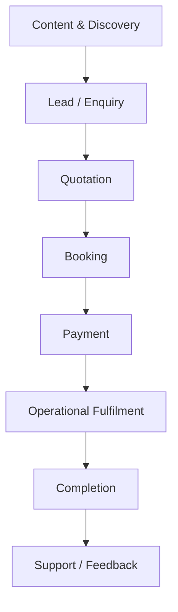
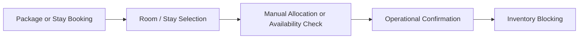

# Business Process Analysis (AS-IS)

## Document Control

| Field | Value |
|---|---|
| Document | Business Process Analysis (AS-IS) |
| Version | 1.0 |
| Status | Draft |
| Repository | farhanmae/gotripzee_docs |
| Related Documents | [Current System Assessment](./02-current-system-assessment.md), [Target Operating Model](./04-target-operating-model.md), [Guiding Architecture Principles](./05-guiding-architecture-principles.md) |

## 1. Purpose

This document describes the current end-to-end business processes supported by the GoTripzee platform as it exists today. The intent is to understand how the business operates, where manual effort is involved, where system behavior is product-specific, and which processes should be preserved or redesigned in the target operating model.

## 2. Scope

The AS-IS analysis covers the business processes related to:

- Customer journey and discovery
- Lead and enquiry handling
- Product and package selection
- Quotation preparation
- Booking creation
- Payment collection
- Inventory confirmation
- Stay allocation
- Fulfilment operations
- Changes, cancellations, and refunds
- Customer communication
- Reporting and operational follow-up

## 3. Business Context

GoTripzee operates as a travel commerce and fulfilment business. The platform is used to sell travel products and support the post-sale operational lifecycle. The business is not purely transactional; it also depends on manual operations, coordination, and staff intervention to deliver services after a booking is made.

The current platform has evolved around multiple product types such as packages, weekend trips, events, cabs, and stays. While these offerings share a common commercial lifecycle, their operational handling is not fully standardized.

## 4. Stakeholders and Roles

| Role | Responsibility |
|---|---|
| Visitor / Prospect | Browses products and submits enquiries |
| Customer | Reviews quotations, books, pays, and receives service |
| Sales / Travel Consultant | Handles enquiry qualification, quotation, and follow-up |
| Operations Team | Allocates inventory and manages fulfilment |
| Finance Team | Manages payment reconciliation, invoices, and refunds |
| Administrator | Manages configuration, products, and operational exceptions |
| Supplier / Partner | Provides inventory or fulfilment support where applicable |

## 5. Current Business Capability Map

## 6. End-to-End AS-IS Journey

### 6.1 Discovery and Interest

The customer first discovers travel content, destinations, or product pages through the website. This can include SEO-driven pages, package listings, or promotional content.

Current behavior:

- Content is used to attract traffic.
- Product pages are used to generate leads.
- The platform serves both marketing and booking needs.

Observation:

- The discovery experience is business-critical because it directly feeds the enquiry pipeline.
- Content and commerce are tightly connected.

### 6.2 Lead and Enquiry Capture

The user submits a lead or enquiry after showing interest in a product.

Current behavior:

- Enquiries may be captured through forms or interaction points on the website.
- Consultants may later qualify the lead and collect travel requirements.
- Customer preferences, dates, traveler count, and destination details are often refined manually.

Pain points:

- Follow-up may depend on manual responsiveness.
- Enquiry data may not always be normalized into a reusable sales workflow.
- Repeated clarification is often needed before quotation.

### 6.3 Requirement Qualification

The sales or travel consultant validates the customer’s need.

Typical questions:

- Destination
- Travel dates
- Number of travelers
- Budget range
- Hotel preferences
- Transport preferences
- Special requests

Current behavior:

- Requirement capture is likely staff-led.
- The process is flexible, but not necessarily structured.

Pain points:

- Knowledge may live in conversations rather than in a strict business object.
- Some follow-up information may be stored in communications rather than in a formal workflow.

### 6.4 Product Selection

The consultant or customer selects a product, such as a package, weekend trip, event, cab, or stay.

Current behavior:

- Products are managed as travel offerings.
- Different product types may have different operational logic.
- Packages may be the most commercially important category.

Pain points:

- Product types may not share a common framework.
- Commercial variations may be handled inconsistently.
- Similar business concepts may be duplicated across modules.

### 6.5 Quotation Preparation

The sales team prepares a quotation based on the selected product and customer needs.

Current behavior:

- Quotation generation may involve manual composition.
- Pricing may depend on product rules, dates, inventory availability, traveler count, and offering type.
- Quotation revisions may happen during negotiation.

Pain points:

- Quotation generation can be time-consuming.
- Pricing logic may be embedded in multiple places.
- If a product includes stay or transport components, those may need to be interpreted manually.

### 6.6 Negotiation and Confirmation

The customer reviews the quotation and may negotiate changes before confirming the booking.

Current behavior:

- Sales staff may revise pricing, inclusions, or service levels.
- Customer confirmation may occur via direct interaction or online booking flow.

Pain points:

- There may be limited distinction between a priced proposal and a firm reservation.
- Changes can create operational ambiguity if not tracked properly.

### 6.7 Booking Creation

Once confirmed, the booking is created in the system.

Current behavior:

- Booking records the commercial commitment.
- Booking creation may trigger or require immediate operational handling.
- Payment and inventory may be tied closely to booking status.

Observation:

- Booking is the key transactional record in the current system.

Pain points:

- The current model may not separate commercial booking from operational allocation.
- Product-specific booking behavior can create inconsistent fulfillment handling.

### 6.8 Payment Collection

The customer makes payment through the payment gateway or other supported channels.

Current behavior:

- Online payment is integrated.
- Payment status is linked to booking confirmation or fulfilment.
- Partial payments or package-specific payment rules may exist.

Pain points:

- Payment logic may be mixed with booking logic.
- Accounting and operational flow may not be cleanly separated.

### 6.9 Operational Fulfilment

After payment or confirmation, the operations team delivers the booked service.

Current behavior:

- Travel staff may allocate stays, transport, and activities.
- Operations may involve internal coordination and external supplier management.
- Actual service delivery depends on resource planning.

Pain points:

- Operational assignments may happen late in the lifecycle.
- The system may not clearly model allocation as a separate business step.
- Inventory blocking may be tied to booking rather than a formal reservation/allocation layer.

### 6.10 Completion and Follow-up

After the trip or travel service is delivered, the case is closed and may enter feedback or support follow-up.

Current behavior:

- Customer support may continue after the trip.
- Refunds, corrections, or complaints may still need management.
- Review handling and re-engagement opportunities may exist.

Pain points:

- Post-trip data may not be structured for analytics or repeat engagement.
- Support and follow-up may not be tightly connected to the original booking lifecycle.

## 7. Product-Specific AS-IS Workflows

### 7.1 Packages

Packages are commercially important and likely represent the primary or one of the primary revenue products.

Current state:

- Packages are sold as structured offerings.
- They may include other services such as stays, transfers, and activities.
- Packaging and pricing may be product-specific.

Assessment:

- Preserve the business model.
- Redesign the implementation so package components are reusable and composable.

### 7.2 Weekend Trips

Weekend trips follow a date-based, capacity-constrained booking model.

Current state:

- Similar to events in operational nature.
- Likely uses product-specific logic.

Assessment:

- These should share a common product framework with events where possible.

### 7.3 Events

Events are also date-based and capacity-constrained.

Current state:

- Similar fulfilment model to weekend trips.

Assessment:

- Strong candidate for reuse of the same booking and inventory patterns.

### 7.4 Cabs

Cabs are inventory-driven and date/time-sensitive.

Current state:

- Likely managed through booking and availability logic.

Assessment:

- Preserve commercial behavior.
- Redesign inventory handling for reusability and better allocation modeling.

### 7.5 Stays

Stay bookings are the most sensitive area from an architecture standpoint.

Current state:

- The current model does not appear to follow a standard hospitality inventory system.
- Stay inventory may be handled less efficiently than it should be.

Assessment:

- Redesign completely around property, room type, availability calendar, reservation, and allocation concepts.

## 8. AS-IS Process Maps

### 8.1 Lead to Booking

### 8.2 Booking to Fulfilment

### 8.3 Stay Handling

## 9. Current Process Characteristics

| Characteristic | Current State |
|---|---|
| Commercial process | Present and active |
| Operational process | Largely manual / staff-driven |
| Inventory handling | Product-specific and inconsistent |
| Booking lifecycle | Present, but not fully normalized |
| Pricing handling | Functional, but distributed |
| Customer journey | Good enough for current operations |
| Supplier handling | Limited and future-oriented |
| Reuse across product types | Low to moderate |
| Multi-company readiness | Not yet fully formalized |

## 10. Pain Points and Bottlenecks

| Area | Pain Point | Impact |
|---|---|---|
| Enquiry handling | Manual qualification and follow-up | Slower conversion |
| Quotation | Staff-heavy preparation and revision | Higher operational effort |
| Booking | Product-specific handling | Inconsistent lifecycle control |
| Inventory | Not normalized across products | Hard to share or block inventory reliably |
| Stay management | Weak inventory model | Operational inefficiency |
| Package composition | Likely static composition | Hard to reuse included services |
| Operations | Coordination-heavy | Increased dependence on staff |
| Post-booking support | Not strongly modelled | Harder to track issues and follow-up |
| Reporting | Limited cross-process visibility | Less strategic insight |

## 11. Business Rules Observed or Inferred

The following business rules are visible or strongly implied from the current platform behavior and the domain discussions:

1. Products can be sold through the website and/or consultant-assisted flows.
2. Packages are commercially important and may include multiple services.
3. Weekend trips and events share a date-based and capacity-based model.
4. Cabs are inventory sensitive and availability constrained.
5. Stay inventory should block when assigned to a booking.
6. Booking confirmation is a major operational trigger.
7. Payment is linked to booking lifecycle and must be preserved.
8. Business processes depend on both automation and manual intervention.

## 12. Operational Dependencies

Current business execution depends on:

- Accurate product content
- Up-to-date pricing
- Timely consultant response
- Reliable payment gateway processing
- Staff coordination for allocations and fulfilment
- Communication tools such as email or messaging

## 13. Improvement Opportunities from AS-IS Analysis

The AS-IS state suggests the following target improvements:

1. Introduce a composable travel product model.
2. Separate reservation from inventory allocation.
3. Normalize stay inventory management.
4. Centralize pricing logic.
5. Build reusable booking flows for similar product families.
6. Improve workflow visibility across sales and operations.
7. Standardize booking status transitions.
8. Reuse ERPNext for enterprise data and finance.
9. Improve customer communication and post-booking traceability.

## 14. Summary

The current business processes are functional and clearly support real commercial activity, but they are shaped by legacy implementation constraints and product-specific handling. The business logic itself is strong; the challenge is the structure of the implementation.

The AS-IS process model shows a consistent commercial pattern across products: discover, enquire, qualify, quote, book, pay, fulfil, and support. The modernization effort should preserve that business pattern while redesigning the underlying platform to support reusable products, shared inventory, explicit reservations, allocation-driven fulfilment, and cleaner ERPNext integration.

## 15. Traceability to Next Documents

This document feeds directly into:

- [Target Operating Model](./04-target-operating-model.md)
- [Guiding Architecture Principles](./05-guiding-architecture-principles.md)
- [Domain Model](./06-domain-model.md)
- [Business Requirements Document](./07-business-requirements-document.md)
