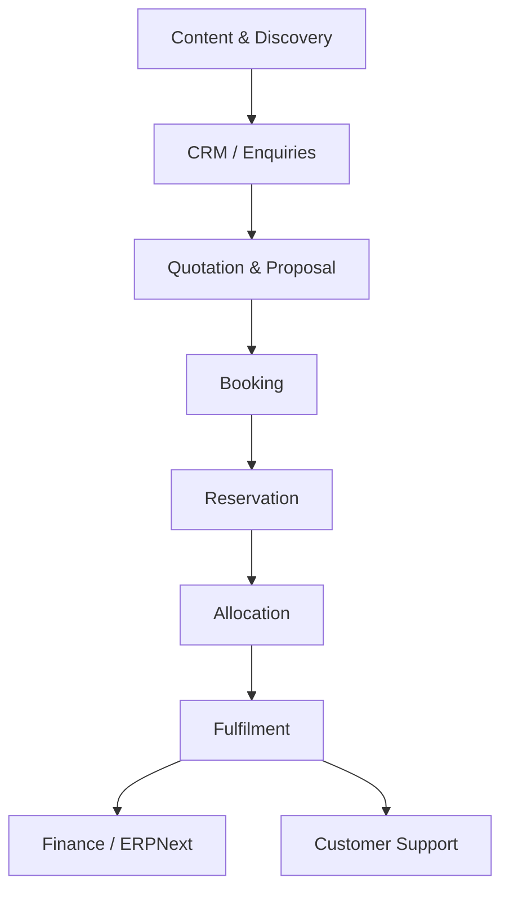

# Target Operating Model

## Document Control

| Field | Value |
|---|---|
| Document | Target Operating Model |
| Version | 1.0 |
| Status | Draft |
| Repository | farhanmae/gotripzee_docs |
| Related Documents | [Current System Assessment](./02-current-system-assessment.md), [Business Process Analysis (AS-IS)](./03-business-process-analysis-as-is.md), [Guiding Architecture Principles](./05-guiding-architecture-principles.md) |

## 1. Purpose

This document defines the future-state operating model for GoTripzee. It explains how the business should function once the modernization program has been implemented, including process ownership, capability boundaries, business roles, and the intended relationship between ERPNext and the travel platform.

## 2. Operating Model Vision

GoTripzee should operate as a composable, ERPNext-extensible travel business platform that supports content-led discovery, consultative selling, dynamic product composition, shared inventory, and structured fulfilment.

The target operating model should enable the business to:

- sell reusable travel products
- compose packages from existing services
- manage inventory consistently across standalone and bundled sales
- separate commercial booking from operational allocation
- support multi-company product visibility
- scale toward supplier and marketplace participation
- improve reporting, governance, and customer experience

## 3. Operating Model Principles

1. ERPNext remains the system of record for enterprise masters and finance.
2. The travel platform owns travel-specific commercial and operational logic.
3. Products are reusable business assets, not one-off booking records.
4. Packages are compositions of other products and services.
5. Reservations and allocations are separate lifecycle steps.
6. Company configuration should drive product availability and pricing.
7. Operations should be structured, trackable, and auditable.
8. The business should be ready for future supplier and marketplace participation.

## 4. Target Organizational Capabilities

| Capability | Target State |
|---|---|
| Product management | Centralized and configurable |
| Content management | Structured and SEO-friendly |
| Lead management | CRM-backed and measurable |
| Quotation management | Semi-automated and reusable |
| Booking management | Generic across product types |
| Inventory management | Shared, normalized, and product-aware |
| Pricing management | Rule-based and centrally governed |
| Fulfilment operations | Allocation-driven and traceable |
| Customer support | Linked to booking and service history |
| Reporting | Cross-functional and decision-oriented |
| Supplier participation | Supported through future extension |
| Marketplace readiness | Designed in from the outset |

## 5. Target Business Architecture

## 6. Core Future-State Capabilities

### 6.1 Product Management

Travel products should be managed as reusable commercial assets.

Future-state behaviors:

- each product has a defined type and offering structure
- each company can enable or disable products
- product variants can be priced independently
- package components can reference existing services

### 6.2 Booking Management

Booking should be the commercial commitment made by the customer.

Future-state behaviors:

- booking creation is standardized across product types
- a booking can include multiple travellers
- bookings can contain reservation records for different fulfilment items
- booking lifecycle status is explicit and trackable

### 6.3 Reservation Management

Reservation should represent the commitment of product capacity to a customer.

Future-state behaviors:

- reservations are created once a booking is confirmed
- reservations can exist before final resource allocation
- reservations can be modified without changing the commercial booking history

### 6.4 Inventory Allocation

Allocation should represent the actual operational assignment of resources.

Future-state behaviors:

- stay inventory can be blocked when added to a package booking
- transport inventory can be assigned after booking confirmation
- operational changes can be made without rewriting the commercial booking
- shared inventory is visible across product types

### 6.5 Pricing Management

Pricing should be governed centrally.

Future-state behaviors:

- base pricing comes from ERPNext where appropriate
- travel-specific pricing rules are applied by the travel platform
- seasonal, occupancy, and product offering rules are supported
- company-specific pricing can be switched on or off

### 6.6 Operations Management

Operations should become an explicit function rather than an informal activity.

Future-state behaviors:

- operations can assign rooms, vehicles, guides, and activities
- exceptions and changes are traceable
- service fulfilment can be audited end to end
- operational dashboards show pending and confirmed allocations

## 7. ERPNext and Travel Platform Ownership Model

### 7.1 ERPNext-Owned Domains

ERPNext should own the following domains:

- Company
- Customer
- Supplier
- Contact
- Address
- User
- Employee
- Accounts
- Sales Invoice
- Payment Entry
- Purchase Invoice
- Price Lists
- Tax Rules
- Core CRM entities
- Role and Permission model

### 7.2 Travel Platform-Owned Domains

The travel platform should own the following domains:

- Travel Product
- Product Offering
- Package Composition
- Booking
- Reservation
- Allocation
- Destination
- Itinerary
- Operations
- Travel-specific pricing rules
- Travel-specific customer preferences

## 8. Target Process Flow

### 8.1 Discovery to Booking

### 8.2 Booking to Fulfilment

## 9. Target Role Model

| Role | Target Responsibility |
|---|---|
| Prospect / Visitor | Discover, enquire, and register interest |
| Sales Consultant | Qualify leads and generate quotations |
| Travel Operations Executive | Allocate resources and manage fulfilment |
| Finance Executive | Reconcile payments and support invoices/refunds |
| Admin / Product Manager | Manage product visibility, configuration, and pricing |
| Customer Support | Handle changes, issues, and post-travel follow-up |
| Management | Review reporting, profitability, and demand trends |

## 10. Multi-Company Operating Model

The target platform should support more than one company or brand from the same codebase.

Expected behavior:

- products can be switched on or off per company
- company-specific pricing and branding are supported
- the same codebase can be reused for different businesses
- company configuration should not require core code changes

## 11. Supplier and Marketplace Readiness

The current business is internally inventory-led, but the target operating model must support future supplier participation.

Future-ready behaviors:

- suppliers can be incorporated as external fulfilment partners
- supplier inventory can be connected later without changing the core model
- marketplace operations can be enabled as a future phase
- supplier data can still flow through ERPNext ownership boundaries

## 12. Customer Experience Target

The target customer journey should be:

- content-rich
- product-driven
- responsive
- booking-focused
- communication-enabled
- self-service capable
- transparent on availability and booking status

The user interface should support discovery and conversion without forcing the customer to understand internal operational complexity.

## 13. Operating Model Controls

The future operating model should include the following controls:

- workflow and approval rules
- booking status governance
- allocation visibility
- cancellation and refund handling
- permission-based company access
- audit logs and change history
- reporting dashboards
- exception handling

## 14. Operating Model Outcomes

| Outcome | Expected Benefit |
|---|---|
| Standardized booking | Lower support burden |
| Shared inventory | Better utilization and fewer conflicts |
| Reusable products | Faster product launches |
| ERPNext integration | Stronger enterprise governance |
| Separate allocation layer | Operational flexibility |
| Multi-company capability | Reusability across businesses |
| Marketplace readiness | Future growth potential |
| Structured operations | Better fulfilment control |

## 15. Risks if Target Model Is Not Adopted

If the current model is retained without redesign, the business is likely to face:

- growing maintenance overhead
- product duplication
- inconsistent inventory logic
- poor reuse across offerings
- more manual work for operations
- limited scalability for new product lines
- weaker readiness for marketplace and AI opportunities

## 16. Transition Approach

The target operating model should be introduced in phases:

1. Establish ERPNext ownership boundaries.
2. Define reusable travel products and offerings.
3. Introduce generic booking and reservation structures.
4. Normalize allocation and inventory management.
5. Rework package composition to use reusable products.
6. Layer in company-specific configuration.
7. Prepare supplier and marketplace extension points.
8. Expand reporting, automation, and AI capabilities.

## 17. Summary

The target operating model defines GoTripzee as a structured travel business platform rather than a set of disconnected booking modules. It emphasizes composability, reuse, operational control, and ERPNext integration. The business should be able to sell products, compose packages, allocate resources, and fulfil bookings in a controlled and auditable way while remaining flexible enough to support future growth.

## 18. Traceability to Next Documents

This document feeds into:

- [Guiding Architecture Principles](./05-guiding-architecture-principles.md)
- [Domain Model](./06-domain-model.md)
- [Business Requirements Document](./07-business-requirements-document.md)
- [Solution Architecture](./08-solution-architecture.md)
