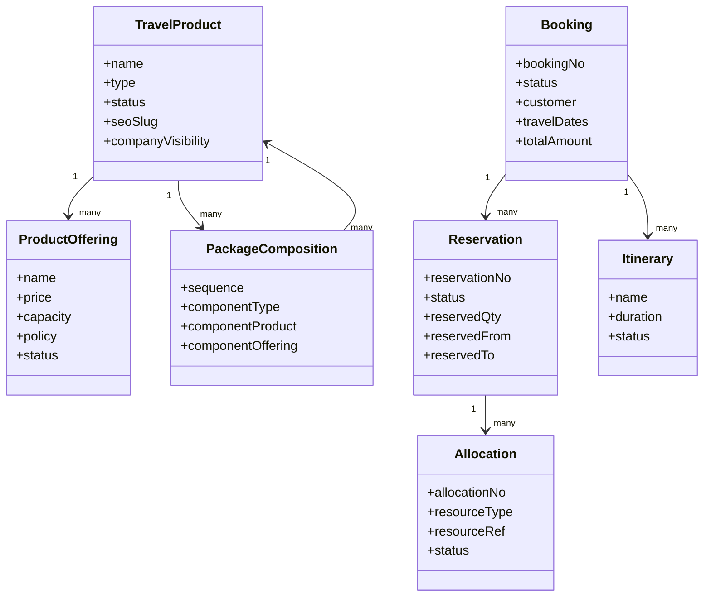
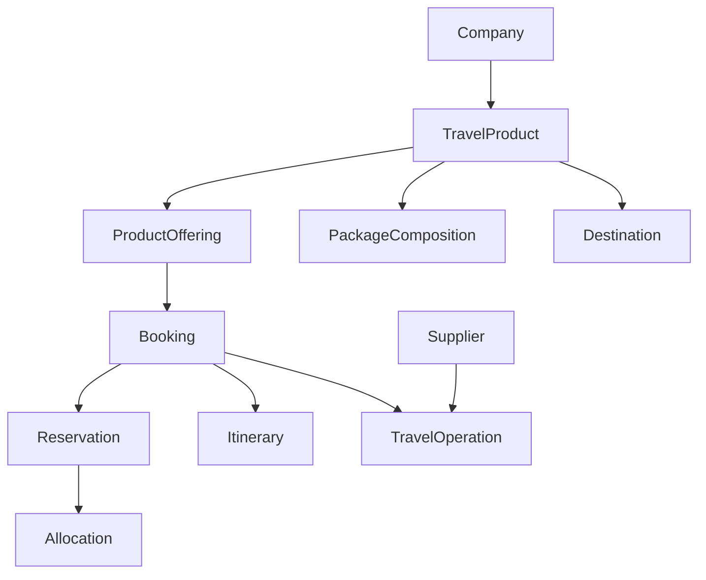

# Domain Model

## Document Control

| Field | Value |
|---|---|
| Document | Domain Model |
| Version | 1.0 |
| Status | Draft |
| Repository | farhanmae/gotripzee_docs |
| Related Documents | [Current System Assessment](./02-current-system-assessment.md), [Business Process Analysis (AS-IS)](./03-business-process-analysis-as-is.md), [Target Operating Model](./04-target-operating-model.md), [Guiding Architecture Principles](./05-guiding-architecture-principles.md) |

## 1. Purpose

This document defines the canonical business domain for the modernized GoTripzee platform. It provides the language, entities, relationships, ownership boundaries, and core concepts that will drive the BRD, SRS, solution architecture, database design, APIs, and implementation approach.

## 2. Domain Philosophy

The platform should be designed around stable business concepts rather than legacy Drupal implementation details.

The correct model is not "Drupal modules rewritten in Frappe".
The correct model is "a composable travel business platform with ERPNext as the enterprise system of record".

## 3. Ubiquitous Language

The following terms are used consistently across the domain:

| Term | Meaning |
|---|---|
| Travel Product | A reusable travel service or commercial offering |
| Product Offering | A sellable variant such as Budget, Standard, or Premium |
| Booking | The commercial commitment made by the customer |
| Reservation | The commitment of service capacity to a booking |
| Allocation | The operational assignment of actual resources |
| Package | A composition of multiple travel products into one commercial offer |
| Itinerary | The structured sequence of travel activities and services |
| Inventory | The available capacity of a travel resource or product |
| Company | A business entity that can enable or disable products |
| Supplier | An ERPNext-owned external or internal fulfilment entity |
| Operation | A fulfilment activity needed to deliver a booking |

## 4. Domain Ownership Boundary

### 4.1 ERPNext-Owned Entities

ERPNext remains the source of truth for enterprise and financial objects.

ERPNext-owned entities include:

- Company
- Customer
- Supplier
- Contact
- Address
- User
- Employee
- Accounts
- Sales Invoice
- Payment Entry
- Purchase Invoice
- Price Lists
- Tax Rules
- Core CRM objects

### 4.2 Travel Platform-Owned Entities

The travel platform owns the travel-specific business model.

Travel platform-owned entities include:

- Travel Product
- Product Offering
- Package Composition
- Booking
- Reservation
- Allocation
- Itinerary
- Destination
- Travel Operation
- Travel-specific pricing rules
- Travel-specific preferences

## 5. Core Business Objects

## 6. Travel Product

A Travel Product is the primary sellable domain object.

Examples:

- Kerala Tour Package
- Munnar Stay
- Airport Transfer
- Desert Safari
- Weekend Trip
- City Sightseeing Event

### Characteristics

- reusable
- company-aware
- offering-based
- inventory-aware
- publishable
- SEO-enabled

### Product Types

Product types define the business behavior of the travel product.

Examples:

- Package
- Stay
- Cab
- Event
- Weekend Trip
- Activity
- Transfer
- Future product types such as Cruise or Visa

## 7. Product Offering

A Product Offering is a sellable variant of a Travel Product.

Examples:

- Budget
- Standard
- Premium
- Luxury

### Why This Matters

Packages and Weekend Trips can have multiple offerings with different pricing, inclusions, and service levels. This avoids duplicating products just to represent variants.

### Offering Attributes

- price
- currency
- capacity
- inclusions
- exclusions
- policy
- tax treatment
- company enablement
- availability window

## 8. Package Composition

Packages are not standalone static content objects. They are compositions of reusable Travel Products.

Example:

- Day 1: Airport Transfer
- Day 1–2: Stay at a listed hotel
- Day 2: Activity
- Day 3: Return Transfer

### Composition Principles

- A package references existing products.
- The same stay can be sold independently and also included in a package.
- Package components should drive reservation and allocation logic.
- A package can include multiple product categories.

## 9. Booking

A Booking represents the commercial commitment from customer to business.

### Booking Responsibilities

- hold customer purchase details
- capture travel dates and traveler counts
- record selected product(s) and offering(s)
- track commercial status
- link to payments, reservations, and allocations

### Booking Statuses

- Draft
- Pending Payment
- Confirmed
- Partially Allocated
- Allocated
- Completed
- Cancelled
- Refunded
- Closed

## 10. Reservation

A Reservation represents the commitment of capacity for a booking.

### Purpose

Reservation is the bridge between a customer purchase and the operational fulfilment of service.

### Reservation Rules

- a booking may create one or many reservations
- reservations may exist before final allocation
- reservations should block availability where required
- reservations are not necessarily the final physical assignment

## 11. Allocation

Allocation represents the actual operational assignment of a real resource.

Examples:

- a specific hotel room
- a specific vehicle
- a specific departure slot
- a specific activity seat

### Why Allocation Is Separate

The business needs to be able to confirm a package booking first and then assign the exact stay or travel resource later. This supports operational flexibility and shared inventory.

### Allocation Behaviour

- creates inventory blocking
- can be updated without changing the commercial booking
- can be reversed or re-assigned if operations change
- is the definitive operational assignment layer

## 12. Inventory

Inventory is the available capacity of a travel resource.

### Inventory Types

- room inventory
- vehicle inventory
- activity inventory
- departure capacity
- seat capacity
- special service capacity

### Inventory Design Requirement

Inventory must be shared across all selling paths.

If a stay is sold directly and also used in a package, both transactions must consume the same underlying inventory pool.

## 13. Itinerary

An Itinerary is the ordered sequence of services delivered to a customer.

### Contents

- service day
- activity sequence
- transfer timing
- accommodation nights
- notes
- inclusion references

### Relationship to Package

A package may generate one itinerary or reuse an existing itinerary template. Itinerary items may reference package components or individual travel products.

## 14. Destination

A Destination represents the geographic or commercial location associated with a travel product.

Examples:

- Kerala
- Munnar
- Dubai
- Goa
- Abu Dhabi

### Destination Use

- marketing pages
- SEO structure
- product filtering
- itinerary planning
- packaging

## 15. Travel Operation

A Travel Operation is a fulfilment task needed to deliver a booking.

Examples:

- vehicle assignment
- room allocation
- guide assignment
- pickup scheduling
- manifest preparation
- supplier confirmation

### Characteristics

- assigned to internal teams or suppliers
- linked to bookings or reservations
- visible in fulfilment dashboards
- auditable and trackable

## 16. Supplier Domain

Supplier is ERPNext-owned, but the travel platform may store travel-specific supplier capabilities through extension records.

### Supplier Characteristics

- service areas
- supported product types
- allocation preferences
- marketplace settings
- preferred status
- fulfilment constraints

## 17. Company Domain

A Company determines how products are published and sold.

### Company Controls

- product enablement
- brand identity
- pricing rules
- taxes
- operational policies
- marketplace participation

### Multi-Company Requirement

The same codebase must support different companies with different product catalogs and commercial settings.

## 18. Domain Relationships

## 19. Domain Rules

1. A Travel Product can have multiple Offerings.
2. A Package can contain multiple product components.
3. A Booking can create one or more Reservations.
4. A Reservation can result in one or more Allocations.
5. Allocation is the step that actually blocks inventory.
6. The same inventory must be shared across direct sales and package sales.
7. ERPNext owns enterprise masters and finance.
8. The travel platform owns travel-specific orchestration and fulfilment.
9. Product enablement must be company-aware.
10. Booking and allocation must remain distinct lifecycle stages.

## 20. Domain Events

Important events in the domain include:

- Enquiry Created
- Quotation Generated
- Booking Confirmed
- Payment Received
- Reservation Created
- Allocation Created
- Allocation Updated
- Booking Cancelled
- Trip Completed
- Refund Processed

## 21. Bounded Contexts

The platform should eventually be implemented through clear bounded contexts such as:

- Content and Discovery
- CRM and Sales
- Product Catalog
- Booking
- Reservations and Allocations
- Pricing
- Operations
- Reporting and Analytics
- ERPNext Integration

## 22. Future Expansion Support

This domain model is designed to support future growth into:

- supplier portals
- B2B agent portals
- marketplace sales
- corporate travel
- white-label brands
- dynamic pricing
- AI recommendations
- new product types

## 23. Summary

The domain model establishes GoTripzee as a composable travel business platform with clear ownership boundaries and reusable commercial structures. The key design shift is to model travel services as reusable products, package them through compositions, and separate booking from reservation and allocation.

This provides the foundation for the BRD, detailed solution architecture, database design, API design, and implementation plan.

## 24. Traceability to Next Documents

This document feeds into:

- [Business Requirements Document](./07-business-requirements-document.md)
- [Solution Architecture](./08-solution-architecture.md)
- [Database Design](./09-database-design.md)
