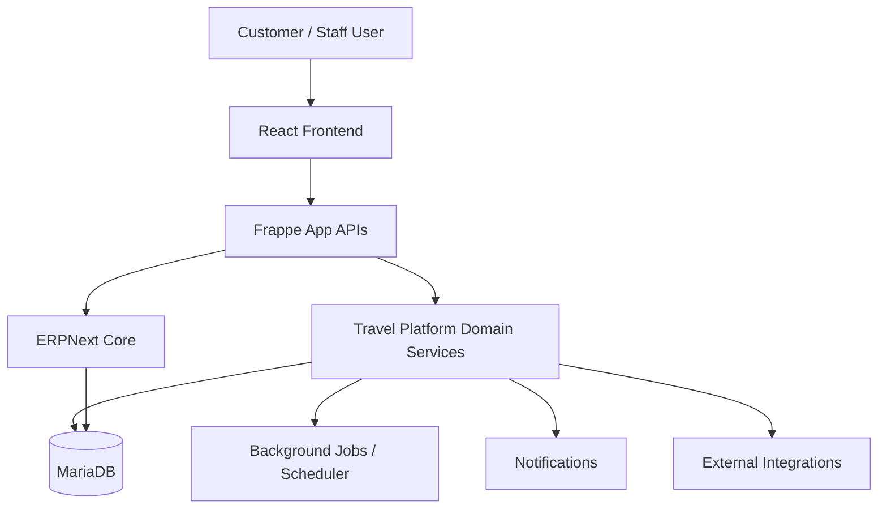
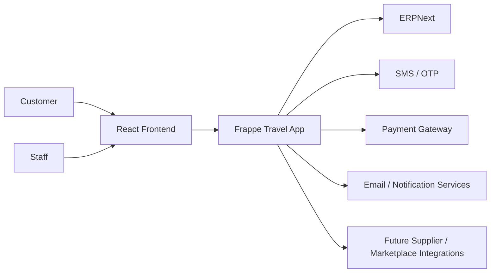
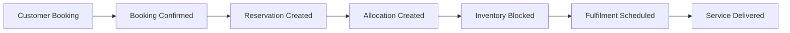

# Solution Architecture

## Document Control

| Field | Value |
|---|---|
| Document | Solution Architecture |
| Version | 1.0 |
| Status | Draft |
| Repository | farhanmae/gotripzee_docs |
| Related Documents | [Current System Assessment](./02-current-system-assessment.md), [Business Process Analysis (AS-IS)](./03-business-process-analysis-as-is.md), [Target Operating Model](./04-target-operating-model.md), [Guiding Architecture Principles](./05-guiding-architecture-principles.md), [Domain Model](./06-domain-model.md), [Business Requirements Document](./07-business-requirements-document.md) |

## 1. Purpose

This document defines the target solution architecture for the GoTripzee modernization program. It describes the major platform layers, system responsibilities, domain boundaries, data flow, integration style, and the architectural patterns used to implement the target operating model.

## 2. Architecture Goals

The solution architecture must:

- extend ERPNext without modifying its core
- support reusable and composable travel products
- separate commercial booking from reservation and allocation
- enable company-specific product visibility and pricing
- support travel operations and fulfilment workflows
- provide a modern React frontend
- expose stable APIs for future integrations
- remain upgrade-safe and maintainable
- create a foundation for marketplace and AI capabilities

## 3. High-Level Architecture

## 4. Architectural Style

The target solution follows a modular, API-first, domain-driven architecture built on top of Frappe and ERPNext.

### Style Characteristics

- modular monolith for the travel application layer
- ERPNext as enterprise backbone
- API-first integration with React frontend
- event-aware business process handling
- background jobs for asynchronous work
- shared data model with clear ownership boundaries

## 5. Layered Architecture

### 5.1 Presentation Layer

The presentation layer is implemented in React using modern frontend patterns.

Responsibilities:

- travel product discovery
- search and filtering
- enquiry capture
- booking flow
- customer dashboards
- operations dashboards where relevant
- admin interfaces if needed

### 5.2 Application Layer

The application layer is implemented in Frappe.

Responsibilities:

- request handling
- API exposure
- workflow orchestration
- document lifecycle management
- permissions enforcement
- integration coordination
- background job triggering

### 5.3 Domain Layer

The domain layer contains business logic for:

- travel products
- product offerings
- package composition
- bookings
- reservations
- allocations
- itineraries
- pricing rules
- company-specific product enablement
- travel operations

### 5.4 Infrastructure Layer

Infrastructure concerns include:

- MariaDB persistence
- Redis / queue handling
- file storage
- email and message transport
- payment gateway access
- scheduled jobs
- logging and monitoring

## 6. System Context

## 7. Major Components

### 7.1 React Frontend

The React frontend will provide the customer and operational interfaces.

Capabilities:

- responsive booking interface
- product listing and detail pages
- enquiry forms
- booking status and tracking
- customer account views
- operational views where appropriate

### 7.2 Frappe Travel Application

The Frappe travel application contains the custom business logic.

Responsibilities:

- document models
- workflows
- APIs
- server-side validation
- background processing
- integration orchestration
- permission-aware operations

### 7.3 ERPNext Core

ERPNext remains the enterprise system of record.

Used for:

- master data ownership
- customers
- suppliers
- finance
- payments
- invoices
- account transactions
- core CRM
- permission infrastructure

### 7.4 Integration Services

Integration services connect the platform to external systems.

Examples:

- SMS / OTP provider
- payment gateway
- email provider
- future supplier systems
- future marketplace channels

## 8. Core Domain Services

### 8.1 Travel Product Service

Manages:

- creation of travel products
- product publishing
- product enablement by company
- offering management
- product metadata

### 8.2 Package Composition Service

Manages:

- package assembly from existing products
- sequence of package items
- reusable components
- package-specific itinerary structure

### 8.3 Booking Service

Manages:

- booking creation
- booking status transitions
- traveler association
- payment linkages
- booking history

### 8.4 Reservation Service

Manages:

- reservation creation
- reservation tracking
- inventory commitment
- partial reservation logic

### 8.5 Allocation Service

Manages:

- physical resource assignment
- stay blocking
- transport assignment
- reallocation and change handling

### 8.6 Pricing Service

Manages:

- base pricing
- offering pricing
- seasonal rules
- company pricing
- package calculations
- pricing rule evaluation

### 8.7 Operations Service

Manages:

- fulfilment planning
- assignment tracking
- supplier coordination
- service completion records

## 9. ERPNext Integration Architecture

### 9.1 Ownership Model

| Business Entity | Owner |
|---|---|
| Company | ERPNext |
| Customer | ERPNext |
| Supplier | ERPNext |
| Contact | ERPNext |
| Address | ERPNext |
| User | ERPNext |
| Employee | ERPNext |
| Sales Invoice | ERPNext |
| Payment Entry | ERPNext |
| Purchase Invoice | ERPNext |
| Price Lists | ERPNext |
| Core CRM | ERPNext |
| Travel Product | Travel App |
| Product Offering | Travel App |
| Booking | Travel App |
| Reservation | Travel App |
| Allocation | Travel App |
| Itinerary | Travel App |
| Operations | Travel App |

### 9.2 Integration Pattern

The travel app should not duplicate ERPNext functionality. Instead it should:

- reuse ERPNext document models where appropriate
- extend master data with travel-specific fields if needed
- call ERPNext APIs or document methods for finance and CRM interactions
- keep ownership boundaries explicit

## 10. Booking to Allocation Flow

This flow supports the critical business rule that a stay can be assigned later and still automatically block the correct inventory.

## 11. Package Composition Architecture

Packages are composed from reusable travel products rather than duplicating those services.

### Example

- Stay Product: listed hotel
- Transfer Product: airport pickup
- Activity Product: local excursion
- Package: composite offering that references all of the above

### Architectural Requirement

If a stay is included in a package, the allocation logic must consume the same underlying inventory pool as a direct stay booking.

## 12. Data Architecture Overview

### 12.1 Core Data Stores

- MariaDB for operational data
- file storage for media and documents
- cached data for performance where appropriate

### 12.2 Data Characteristics

- transactional documents in Frappe/ERPNext style
- normalized relationships for products, bookings, and allocations
- audit-friendly lifecycle changes
- shared inventory records

## 13. API Architecture

The API layer should be designed around stable resource-based endpoints and service boundaries.

### API Characteristics

- REST-first
- document-centric where appropriate
- authorization-aware
- reusable across frontend and future partner integrations
- versionable when necessary

### Core API Families

- product catalog APIs
- enquiry APIs
- quotation APIs
- booking APIs
- reservation APIs
- allocation APIs
- pricing APIs
- operations APIs
- reporting APIs

## 14. Security Architecture

### Security Principles

- reuse Frappe authentication and ERPNext permissions
- enforce company-aware access control
- keep finance and operational permissions separate where required
- protect APIs with role-based access
- store secrets outside application code

### Security Controls

- authentication
- authorization
- audit logs
- secure integration credentials
- API validation
- access restriction by role and company

## 15. Asynchronous Processing Architecture

Use background jobs and scheduler processes for tasks such as:

- sending notifications
- syncing external systems
- processing delayed inventory updates
- generating reports
- performing follow-up actions
- computing pricing or allocation side effects where appropriate

## 16. Observability Architecture

The solution should include:

- application logs
- audit trail
- workflow history
- integration failure tracking
- operational dashboards
- performance monitoring

## 17. Deployment Architecture

A typical deployment should include:

- React frontend
- Frappe application server
- worker processes
- scheduler process
- MariaDB
- Redis / queue layer
- reverse proxy
- object storage if needed

The deployment model should support development, staging, and production environments.

## 18. Extensibility Considerations

The architecture should support future extension into:

- supplier portal
- B2B agent portal
- white-label deployments
- corporate travel
- marketplace sales
- AI-assisted booking and support
- mobile applications
- new travel product types

## 19. Non-Functional Architecture Requirements

### Maintainability

The architecture shall minimize coupling and maximize reuse.

### Scalability

The system shall support growing products, bookings, companies, and integrations.

### Reliability

Critical booking and payment paths should be resilient and traceable.

### Upgrade Safety

ERPNext core must remain untouched and upgrade-safe.

### Flexibility

The architecture should allow future business expansion without redesigning the core model.

## 20. Architectural Decisions

1. Use Frappe for business application logic.
2. Use React for the frontend experience.
3. Use ERPNext as the enterprise system of record.
4. Model travel products as reusable assets.
5. Separate booking from reservation and allocation.
6. Keep inventory shared across all selling paths.
7. Use company-aware configuration for product enablement.
8. Use background jobs for asynchronous work.
9. Keep APIs stable and service-oriented.
10. Support future marketplace and AI growth.

## 21. Summary

The solution architecture establishes a modern travel business platform built on Frappe and ERPNext, with React providing the customer experience layer. The core architectural shift is the move from product-specific implementation to reusable travel products, composable packages, explicit reservations, and allocation-driven fulfilment.

This architecture keeps the enterprise backbone in ERPNext, preserves upgrade safety, and creates a flexible foundation for future business growth.

## 22. Traceability to Next Documents

This document feeds into:

- [Database Design](./09-database-design.md)
- [API Specification](./10-api-specification.md)
- [Frontend Architecture](./11-frontend-architecture.md)
- [Backend Architecture](./12-backend-architecture.md)
- [Migration Strategy](./16-migration-strategy.md)
