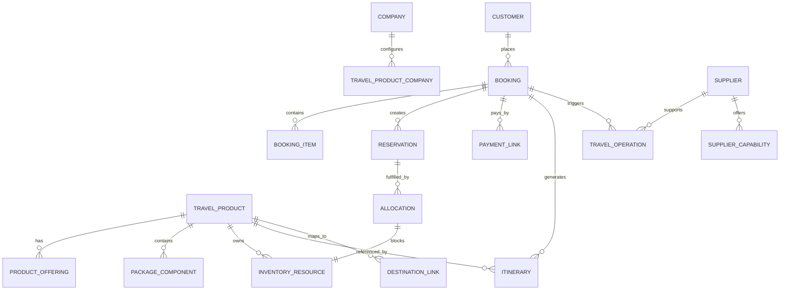

# Database Design

## Document Control

| Field | Value |
|---|---|
| Document | Database Design |
| Version | 1.0 |
| Status | Draft |
| Repository | farhanmae/gotripzee_docs |
| Related Documents | [Domain Model](./06-domain-model.md), [Business Requirements Document](./07-business-requirements-document.md), [Solution Architecture](./08-solution-architecture.md) |

## 1. Purpose

This document defines the target logical database design for the GoTripzee modernization program. It translates the domain model into structured data entities, relationships, and persistence patterns suitable for implementation in Frappe and ERPNext extension layers.

## 2. Design Goals

The database design must:

- support reusable and composable travel products
- separate booking from reservation and allocation
- enable shared inventory across direct and bundled sales
- support company-specific product enablement
- reuse ERPNext-owned master data where appropriate
- remain normalized and maintainable
- preserve auditability and lifecycle history
- support future supplier and marketplace expansion

## 3. Database Design Principles

1. ERPNext master data must not be duplicated unnecessarily.
2. Travel-specific objects should be normalized and reusable.
3. Booking, reservation, and allocation should be separate records.
4. Inventory must be shared across all selling paths.
5. Package components should reference existing products instead of storing duplicate service data.
6. Company visibility should be modelled explicitly.
7. Lifecycle histories should be retained for commercial and operational auditability.
8. The schema should support future product types without major redesign.

## 4. Logical Data Model Overview

## 5. Core Entities

### 5.1 Travel Product

Represents a reusable travel service or commercial product.

#### Key Fields

- name
- code / slug
- product type
- status
- description
- destination reference
- media reference
- SEO metadata
- publish state
- default company scope

### 5.2 Product Offering

Represents a sellable variant of a travel product.

#### Key Fields

- travel product reference
- offering name
- price
- currency
- capacity
- inclusions
- exclusions
- policy reference
- availability window
- company enablement
- active flag

### 5.3 Travel Product Company Configuration

Represents company-wise enablement and commercial configuration.

#### Key Fields

- travel product reference
- company reference
- enabled flag
- pricing profile
- tax profile
- visibility flags
- marketplace flags
- operating notes

### 5.4 Package Component

Represents a reusable component within a package.

#### Key Fields

- package travel product reference
- sequence number
- component type
- referenced travel product
- referenced offering
- day / slot reference
- quantity
- allocation rule

### 5.5 Booking

Represents the customer’s commercial commitment.

#### Key Fields

- booking number
- customer reference
- company reference
- booking status
- booking date
- travel start / end dates
- total value
- currency
- source channel
- quotation reference
- payment status

### 5.6 Booking Item

Represents the individual products or services included in a booking.

#### Key Fields

- booking reference
- travel product reference
- offering reference
- quantity
- unit price
- subtotal
- fulfillment type
- component reference

### 5.7 Reservation

Represents a commitment of capacity for a booking.

#### Key Fields

- booking reference
- booking item reference
- reservation status
- reserved quantity
- reserved from / to
- hold expiry
- reservation type
- allocation status

### 5.8 Allocation

Represents a specific operational assignment of a resource.

#### Key Fields

- reservation reference
- inventory resource reference
- allocation status
- allocated quantity
- allocated from / to
- block status
- reassignment reason

### 5.9 Inventory Resource

Represents the operationally blockable resource, such as a room, vehicle, departure slot, or activity capacity.

#### Key Fields

- travel product reference
- resource type
- resource code
- availability status
- capacity
- operational dates
- company reference
- supplier reference where applicable

### 5.10 Itinerary

Represents the structured sequence of services for a booking or product template.

#### Key Fields

- booking reference or product reference
- itinerary name
- day sequence
- notes
- status
- visibility

### 5.11 Travel Operation

Represents a fulfilment task.

#### Key Fields

- booking reference
- reservation reference
- allocation reference
- operation type
- assigned to
- due date
- status
- notes

### 5.12 Supplier Capability

Represents travel-specific supplier service metadata.

#### Key Fields

- supplier reference
- supported product types
- service areas
- preferred flag
- allocation policy
- fulfillment notes

## 6. Entity-by-Entity Design Notes

### 6.1 ERPNext-Owned Entities

The following entities should not be duplicated in the travel schema except where lightweight references are required:

- Company
- Customer
- Supplier
- Contact
- Address
- User
- Employee
- Sales Invoice
- Payment Entry
- Purchase Invoice
- Price List
- Tax Rule

### 6.2 Travel Platform-Owned Entities

The following entities should be implemented in the travel schema:

- Travel Product
- Product Offering
- Travel Product Company Configuration
- Package Component
- Booking
- Booking Item
- Reservation
- Allocation
- Inventory Resource
- Itinerary
- Travel Operation
- Supplier Capability

## 7. Relationships and Cardinality

### 7.1 Product Relationships

- A Travel Product can have many Product Offerings.
- A Travel Product can belong to many Company Configurations.
- A Package Travel Product can have many Package Components.
- A Package Component points to one reusable Travel Product.

### 7.2 Booking Relationships

- One Customer can create many Bookings.
- One Booking can contain many Booking Items.
- One Booking can create many Reservations.
- One Reservation can create many Allocations.
- One Reservation should map to one or more inventory resources depending on product type.

### 7.3 Inventory Relationships

- One Inventory Resource belongs to one Travel Product or service instance.
- One Allocation blocks one Inventory Resource or capacity slice.
- One resource can be allocated to one or many bookings depending on time-window design, but overlapping allocations must be prevented.

## 8. Inventory Blocking Model

The inventory model must support the critical rule that stay inventory is blocked when a listed stay is added to a package booking.

### Required Behaviour

- the package booking references the stay product or offering
- the booking creates a reservation for the stay component
- the reservation creates an allocation record
- the allocation blocks the same underlying inventory pool as a direct stay sale

### Result

The direct stay sale and the stay included in a package both reduce availability against the same inventory resource or inventory series.

## 9. Stay-Specific Data Design

Because stay booking requires special treatment, the schema should support hospitality-style inventory concepts.

### Proposed Structures

- Property / Stay Product
- Room Type
- Rate Plan / Offering
- Inventory Calendar
- Reservation
- Allocation

### Notes

- The current implementation may not cleanly support this model.
- The target design should allow daily inventory blocking and change of assigned room/resource after booking.

## 10. Package Composition Data Design

Packages should not store duplicate content for included services.

### Instead, packages should store:

- sequence order
- component type
- referenced travel product
- referenced offering
- fulfillment rule
- reservation rule
- allocation rule

### Benefit

This allows the same stay or activity to appear in multiple packages and remain inventory-consistent.

## 11. Pricing Data Design

Pricing should be modelled in a way that supports both ERPNext base price structures and travel-specific rules.

### Recommended Logical Entities

- Base Price Reference
- Product Offering Price
- Company Price Override
- Seasonal Price Rule
- Occupancy Rule
- Package Price Rule
- Discount Rule
- Promotion Rule

### Ownership

- ERPNext owns base enterprise pricing structures where applicable.
- The travel platform owns travel-specific evaluation logic.

## 12. Status and Lifecycle Design

### Booking Statuses

- Draft
- Pending Payment
- Confirmed
- Partially Allocated
- Allocated
- Completed
- Cancelled
- Refunded
- Closed

### Reservation Statuses

- Open
- Held
- Confirmed
- Allocated
- Released
- Cancelled

### Allocation Statuses

- Pending
- Blocked
- Assigned
- Reassigned
- Released
- Cancelled

## 13. Audit and History Requirements

The schema should retain lifecycle history for the following actions:

- booking creation and modification
- reservation creation and release
- allocation creation and reassignment
- inventory blocking and release
- payment changes
- cancellation and refund processing
- product enablement by company

## 14. Denormalization Guidance

The design should remain normalized at the core, but the following may be denormalized where appropriate for performance:

- booking summary fields
- pricing summary fields
- inventory availability snapshots
- reporting aggregates
- search-friendly product metadata

These should be derived rather than treated as primary source data.

## 15. Suggested Frappe DocTypes

### Foundation DocTypes

- Travel Product
- Product Offering
- Travel Product Company Configuration
- Package Component
- Destination
- Supplier Capability

### Transactional DocTypes

- Booking
- Booking Item
- Reservation
- Allocation
- Travel Operation
- Itinerary

### Supporting DocTypes

- Inventory Resource
- Inventory Calendar
- Pricing Rule
- Cancellation Policy
- Travel Document

## 16. Database Risks and Considerations

### Risks

- over-normalization can make booking queries expensive if not designed carefully
- duplicate master data with ERPNext can introduce consistency problems
- inventory blocking must be transaction-safe
- allocation changes must preserve commercial booking history
- reporting should avoid heavy joins on critical operational paths

### Mitigations

- use proper indexing
- store summary fields where justified
- keep ownership boundaries clear
- use transactional updates for inventory changes
- use background jobs for non-critical synchronization

## 17. Future Expansion Considerations

The schema should be able to support:

- supplier inventory feeds
- marketplace listings
- corporate travel
- B2B agent allocations
- white-label deployments
- dynamic pricing models
- AI-driven itinerary generation
- additional product types such as cruise, insurance, visa, or activities

## 18. Summary

The database design establishes a normalized and reusable travel platform schema centered on Travel Product, Product Offering, Booking, Reservation, Allocation, and Inventory Resource. The model preserves ERPNext ownership for enterprise masters while enabling the travel platform to manage travel-specific commercial and operational workflows.

This schema supports the key modernization goals: composable packages, shared inventory, company-aware product enablement, and upgrade-safe ERPNext integration.

## 19. Traceability to Next Documents

This document feeds into:

- [API Specification](./10-api-specification.md)
- [UX/UI Modernization](./11-ux-ui-modernization.md)
- [Technical Debt Report](./12-technical-debt-report.md)
- [Migration Strategy](./14-migration-strategy.md)
