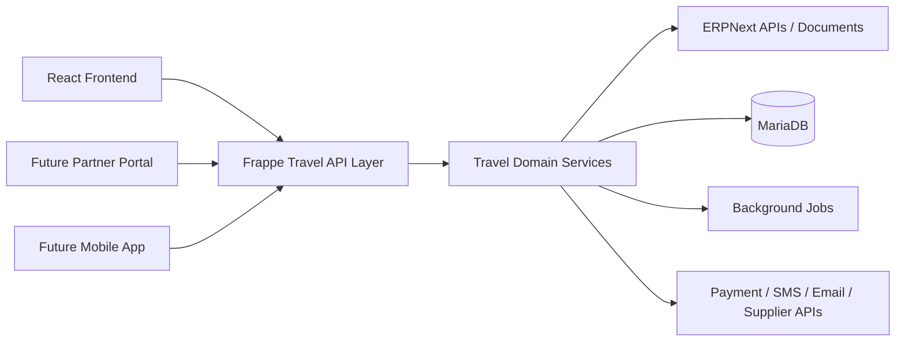
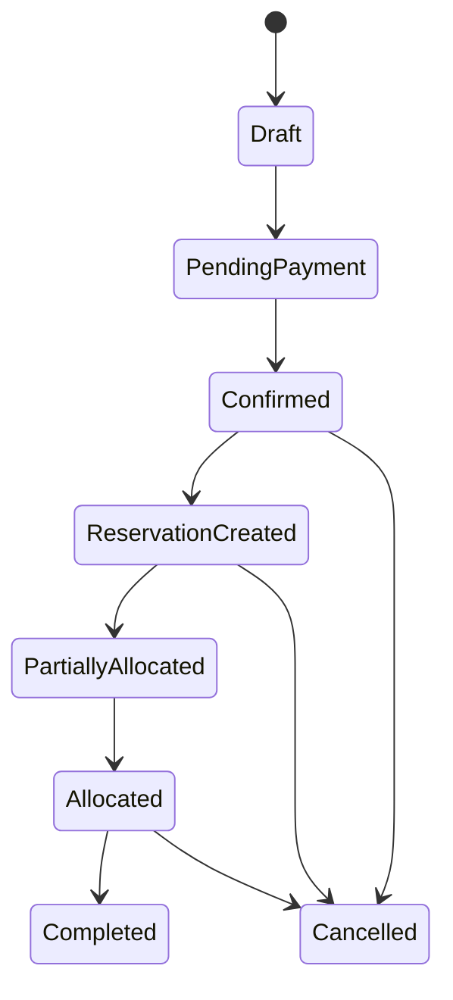

# API Specification

## Document Control

| Field | Value |
|---|---|
| Document | API Specification |
| Version | 1.0 |
| Status | Draft |
| Repository | farhanmae/gotripzee_docs |
| Related Documents | [Solution Architecture](./08-solution-architecture.md), [Database Design](./09-database-design.md), [Frontend Architecture](./11-frontend-architecture.md), [Backend Architecture](./12-backend-architecture.md), [Integration Architecture](./13-integration-architecture.md), [Security Architecture](./14-security-architecture.md) |

## 1. Purpose

This document defines the target API architecture for the modernized GoTripzee platform. It describes API families, ownership boundaries, resource naming, lifecycle operations, authorization expectations, integration responsibilities, and traceability to the business domain.

The API design is intentionally architecture-level. It avoids implementation code while giving enough structure for future OpenAPI specifications, Frappe method definitions, React integration, partner APIs, and automated testing.

## 2. Scope

This specification covers APIs exposed by the custom Frappe travel application and APIs consumed from ERPNext or external systems.

In scope:

- product discovery APIs
- product offering APIs
- package composition APIs
- enquiry and quotation APIs
- booking APIs
- reservation APIs
- allocation and operations APIs
- pricing APIs
- inventory APIs
- customer dashboard APIs
- staff dashboard APIs
- ERPNext integration APIs
- payment, notification, and supplier integration APIs

Out of scope:

- low-level framework implementation
- final route decorators
- UI component contracts
- vendor-specific SDK code

## 3. API Design Goals

| Goal | Description |
|---|---|
| API-first | React, staff tools, future mobile apps, and partner channels must consume stable APIs. |
| Domain-aligned | APIs must reflect Travel Product, Product Offering, Booking, Reservation, Allocation, and Inventory. |
| ERPNext-safe | APIs must call or reference ERPNext-owned objects without duplicating ERPNext core responsibility. |
| Company-aware | Every relevant API must evaluate Company context and product enablement. |
| Secure by default | APIs must enforce authentication, authorization, validation, and auditability. |
| Versionable | Public and partner-facing APIs must support versioning without breaking consumers. |
| Observable | APIs must be traceable through logs, audit records, correlation IDs, and integration status. |

## 4. API Architecture Overview

## 5. API Ownership Boundary

| API Area | Owning System | Notes |
|---|---|---|
| Company lookup | ERPNext | Travel app may filter by permitted company. |
| Customer account reference | ERPNext | Travel app may expose customer profile summaries through authorized APIs. |
| Supplier lookup | ERPNext | Travel app stores supplier travel capabilities separately. |
| Sales Invoice | ERPNext | Travel app requests invoice creation or references ERPNext invoice records. |
| Payment Entry | ERPNext | Travel app links payments to bookings and ERPNext accounting documents. |
| Travel Product | Travel App | Primary reusable travel object. |
| Product Offering | Travel App | Sellable variant of a Travel Product. |
| Package Composition | Travel App | References reusable Travel Products and Offerings. |
| Booking | Travel App | Commercial commitment. |
| Reservation | Travel App | Capacity commitment. |
| Allocation | Travel App | Operational assignment. |
| Inventory Resource | Travel App | Shared inventory across direct and package sales. |

## 6. API Standards

| Standard | Target Convention |
|---|---|
| Style | REST-first resource APIs with Frappe-compatible methods where appropriate |
| Format | JSON |
| Authentication | Frappe session, token, OAuth-compatible future extension, or signed partner credential |
| Authorization | Role, permission, Company, and document-level access |
| Versioning | `/api/v1/...` for stable external-facing APIs |
| Pagination | Required for list endpoints |
| Filtering | Explicit query parameters, never implicit client-side filtering for secured data |
| Idempotency | Required for payment, booking confirmation, reservation creation, and integration callbacks |
| Errors | Standard error envelope with code, message, details, correlation_id |
| Auditing | Required for commercial, financial, inventory, and operational state transitions |

## 7. Resource Naming Model

| Domain Object | Resource Path |
|---|---|
| Travel Product | `/api/v1/travel-products` |
| Product Offering | `/api/v1/product-offerings` |
| Package Composition | `/api/v1/packages/{product_id}/components` |
| Enquiry | `/api/v1/enquiries` |
| Quotation | `/api/v1/quotations` |
| Booking | `/api/v1/bookings` |
| Reservation | `/api/v1/reservations` |
| Allocation | `/api/v1/allocations` |
| Inventory | `/api/v1/inventory` |
| Pricing | `/api/v1/pricing` |
| Operations | `/api/v1/operations` |
| Customer Dashboard | `/api/v1/customer/...` |
| Staff Dashboard | `/api/v1/staff/...` |

## 8. Core API Families

### 8.1 Product Catalog APIs

Purpose:

Expose searchable and company-aware Travel Product data to the React frontend and future sales channels.

Representative endpoints:

| Method | Endpoint | Purpose |
|---|---|---|
| GET | `/api/v1/travel-products` | List published and company-enabled products. |
| GET | `/api/v1/travel-products/{id}` | Retrieve product detail, media, SEO, and available offerings. |
| GET | `/api/v1/travel-products/{id}/offerings` | List Product Offerings for a product. |
| GET | `/api/v1/travel-products/{id}/availability` | Retrieve availability summary for selected dates and company. |

Key rules:

- Only company-enabled products are returned.
- Packages expose referenced components but do not duplicate component product data.
- Inventory availability must reflect shared inventory across direct and package sales.

### 8.2 Product Offering APIs

Purpose:

Expose sellable variants such as Budget, Standard, Premium, and Luxury.

Representative endpoints:

| Method | Endpoint | Purpose |
|---|---|---|
| GET | `/api/v1/product-offerings/{id}` | Retrieve offering details. |
| GET | `/api/v1/product-offerings/{id}/price` | Retrieve price for date, company, travelers, and channel. |
| GET | `/api/v1/product-offerings/{id}/policy` | Retrieve cancellation, inclusion, exclusion, and booking policy. |

### 8.3 Package APIs

Purpose:

Support package discovery and package composition without duplicating stay, transfer, activity, or meal data.

Representative endpoints:

| Method | Endpoint | Purpose |
|---|---|---|
| GET | `/api/v1/packages/{product_id}/components` | List package components by sequence/day. |
| GET | `/api/v1/packages/{product_id}/itinerary` | Retrieve template itinerary. |
| POST | `/api/v1/packages/{product_id}/price-preview` | Calculate package price for selected offering and traveler assumptions. |
| POST | `/api/v1/packages/{product_id}/availability-preview` | Check component availability across shared inventory. |

Critical rule:

If a package includes Stay A, availability must be checked against Stay A inventory exactly as a direct Stay A sale would.

### 8.4 Enquiry APIs

Purpose:

Capture customer intent and create a traceable path into ERPNext CRM and travel sales operations.

Representative endpoints:

| Method | Endpoint | Purpose |
|---|---|---|
| POST | `/api/v1/enquiries` | Create enquiry from customer or website form. |
| GET | `/api/v1/enquiries/{id}` | Retrieve enquiry for authorized staff/customer. |
| POST | `/api/v1/enquiries/{id}/qualify` | Mark enquiry as qualified and attach requirements. |
| POST | `/api/v1/enquiries/{id}/convert-to-quotation` | Create quotation draft. |

ERPNext relationship:

CRM ownership remains with ERPNext. The travel application stores travel-specific requirements and links to ERPNext Lead, Opportunity, or Customer records as appropriate.

### 8.5 Quotation APIs

Purpose:

Support consultative sales, quotation revisions, and booking conversion.

Representative endpoints:

| Method | Endpoint | Purpose |
|---|---|---|
| POST | `/api/v1/quotations` | Create quotation draft. |
| GET | `/api/v1/quotations/{id}` | Retrieve quotation detail. |
| POST | `/api/v1/quotations/{id}/revise` | Create controlled revision. |
| POST | `/api/v1/quotations/{id}/approve` | Customer or staff approval workflow. |
| POST | `/api/v1/quotations/{id}/convert-to-booking` | Create Booking as commercial commitment. |

### 8.6 Booking APIs

Purpose:

Manage the commercial commitment between customer and business.

Representative endpoints:

| Method | Endpoint | Purpose |
|---|---|---|
| POST | `/api/v1/bookings` | Create booking draft. |
| GET | `/api/v1/bookings/{id}` | Retrieve booking detail. |
| POST | `/api/v1/bookings/{id}/confirm` | Confirm booking after business and payment rules pass. |
| POST | `/api/v1/bookings/{id}/cancel` | Cancel booking through controlled lifecycle rules. |
| GET | `/api/v1/bookings/{id}/timeline` | Retrieve commercial and operational event history. |

Important distinction:

Booking APIs do not directly assign a specific hotel room, vehicle, seat, or activity slot. Those are Allocation responsibilities.

### 8.7 Reservation APIs

Purpose:

Create and manage capacity commitments generated from confirmed bookings.

Representative endpoints:

| Method | Endpoint | Purpose |
|---|---|---|
| POST | `/api/v1/bookings/{id}/reservations` | Generate reservations from booking items. |
| GET | `/api/v1/reservations/{id}` | Retrieve reservation. |
| POST | `/api/v1/reservations/{id}/hold` | Hold capacity for a defined period. |
| POST | `/api/v1/reservations/{id}/release` | Release committed capacity. |

### 8.8 Allocation APIs

Purpose:

Assign actual operational resources against reservations.

Representative endpoints:

| Method | Endpoint | Purpose |
|---|---|---|
| POST | `/api/v1/reservations/{id}/allocations` | Create allocation for resource assignment. |
| POST | `/api/v1/allocations/{id}/reassign` | Reassign resource while preserving booking history. |
| POST | `/api/v1/allocations/{id}/release` | Release resource block. |
| GET | `/api/v1/allocations?booking={id}` | List allocations for a booking. |

Inventory rule:

Allocation is the step that blocks or assigns the actual inventory resource.

### 8.9 Pricing APIs

Purpose:

Provide centralized pricing evaluation for catalog preview, quotation, and booking flows.

Representative endpoints:

| Method | Endpoint | Purpose |
|---|---|---|
| POST | `/api/v1/pricing/preview` | Preview price for product/offering/date/travelers/company. |
| POST | `/api/v1/pricing/package-preview` | Evaluate package pricing from reusable components. |
| GET | `/api/v1/pricing/rules/{id}` | Retrieve pricing rule for authorized staff. |

Ownership:

ERPNext owns enterprise price lists where applicable. The travel application owns travel-specific pricing evaluation logic.

### 8.10 Operations APIs

Purpose:

Support fulfilment, staff workflows, exceptions, and service completion.

Representative endpoints:

| Method | Endpoint | Purpose |
|---|---|---|
| GET | `/api/v1/operations/tasks` | List pending operations tasks. |
| POST | `/api/v1/operations/tasks/{id}/assign` | Assign task to staff or team. |
| POST | `/api/v1/operations/tasks/{id}/complete` | Mark fulfilment task complete. |
| POST | `/api/v1/operations/exceptions` | Record operational exception. |

## 9. State Transition APIs

Lifecycle transitions should be explicit and auditable.

Each transition API must:

- validate current state
- validate role and Company access
- record audit history
- emit a domain event
- prevent duplicate execution through idempotency where applicable

## 10. Error Response Model

All APIs should use a consistent error envelope.

| Field | Description |
|---|---|
| code | Stable machine-readable error code |
| message | User-safe error summary |
| details | Validation or domain-specific details |
| correlation_id | Request correlation identifier |
| traceable_document | Related Booking, Reservation, Allocation, or integration log |

## 11. Authorization Matrix

| API Family | Customer | Sales | Operations | Finance | Admin | Partner |
|---|---:|---:|---:|---:|---:|---:|
| Product Catalog | Read | Read | Read | Read | Manage | Read limited |
| Enquiry | Own create/read | Manage | Read limited | Read limited | Manage | Create limited |
| Quotation | Own read/approve | Manage | Read | Read | Manage | None initially |
| Booking | Own read/create | Manage | Read | Read | Manage | Create/read limited future |
| Reservation | Read limited | Read | Manage | Read | Manage | None initially |
| Allocation | No direct access | Read | Manage | Read | Manage | Supplier-specific future |
| Pricing | Preview | Manage | Read | Read | Manage | Preview limited future |
| Finance Links | Own status | Read | Read | Manage | Manage | None |

## 12. Integration Callback APIs

Payment, SMS, email, and supplier callbacks require stronger controls than normal browser APIs.

Controls:

- signature verification
- idempotency key
- replay protection
- integration log record
- controlled retry behavior
- no direct inventory or finance mutation without domain service validation

## 13. Traceability

| Requirement | API Coverage |
|---|---|
| Reusable Travel Products | Product Catalog and Product Offering APIs |
| Package composition by reference | Package APIs |
| Booking as commercial commitment | Booking APIs |
| Reservation as capacity commitment | Reservation APIs |
| Allocation as operational assignment | Allocation APIs |
| Shared inventory | Inventory, Reservation, and Allocation APIs |
| Company-aware enablement | Catalog, Pricing, Booking, and Staff APIs |
| ERPNext ownership | ERPNext integration APIs and finance link APIs |

## 14. Summary

The API specification establishes a stable, domain-aligned API layer for the modernized GoTripzee platform. The APIs keep business logic inside the Frappe travel application, expose consistent services to React and future channels, preserve ERPNext ownership, and enforce the separation between Booking, Reservation, and Allocation.

## 15. Traceability to Next Documents

This document feeds into:

- [Frontend Architecture](./11-frontend-architecture.md)
- [Backend Architecture](./12-backend-architecture.md)
- [Integration Architecture](./13-integration-architecture.md)
- [Security Architecture](./14-security-architecture.md)
- [Testing Strategy](./17-testing-strategy.md)
