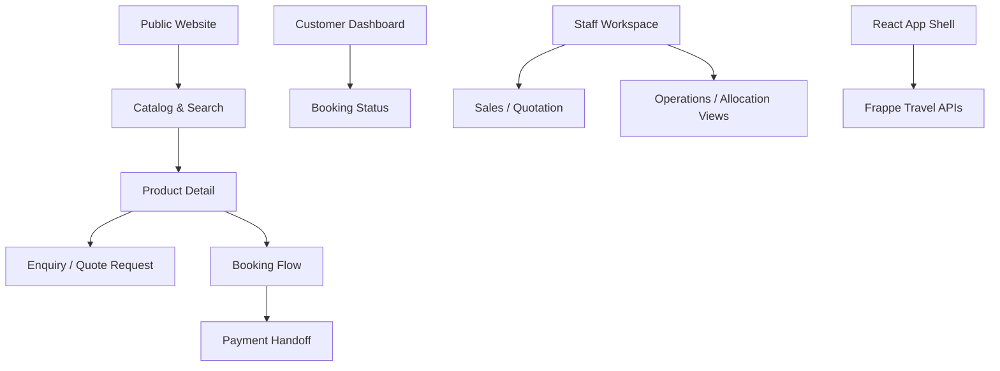
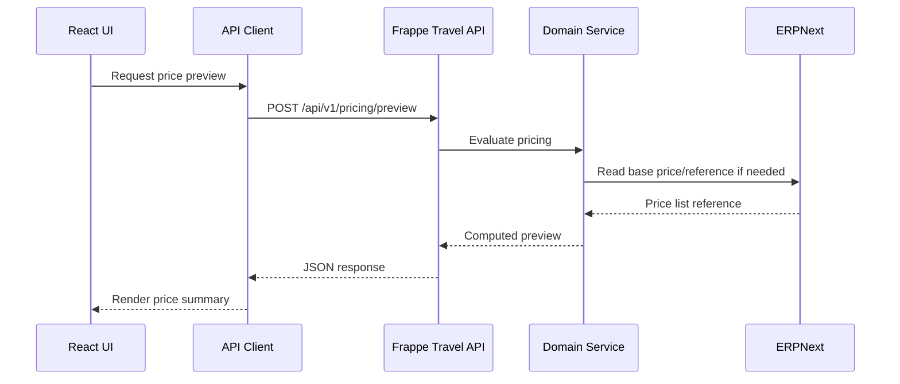

# Frontend Architecture

## Document Control

| Field | Value |
|---|---|
| Document | Frontend Architecture |
| Version | 1.0 |
| Status | Draft |
| Repository | farhanmae/gotripzee_docs |
| Related Documents | [Solution Architecture](./08-solution-architecture.md), [API Specification](./10-api-specification.md), [Security Architecture](./14-security-architecture.md), [Testing Strategy](./17-testing-strategy.md) |

## 1. Purpose

This document defines the target React frontend architecture for the modernized GoTripzee platform. It describes frontend responsibilities, application boundaries, user journeys, state management, API consumption, security expectations, and operational considerations.

## 2. Scope

The frontend architecture covers:

- public travel discovery experience
- product detail and offering selection
- package exploration
- enquiry and quotation journeys
- booking flow
- customer dashboard
- staff sales and operations views where appropriate
- authentication experience
- API integration patterns
- accessibility, performance, and observability expectations

## 3. Design Goals

| Goal | Description |
|---|---|
| Customer-first | The product discovery and booking journey should be fast, clear, and mobile-friendly. |
| API-first | All business actions must call the Frappe travel APIs; business logic must not live in React components. |
| Domain-aligned | UI concepts should reflect Travel Product, Product Offering, Booking, Reservation, and Allocation correctly. |
| Company-aware | Branding, content, product visibility, and pricing must respect Company context. |
| Secure | Sensitive actions require authenticated and authorized API calls. |
| Maintainable | UI modules should map to business capabilities rather than page-specific duplication. |

## 4. Frontend Application Landscape

## 5. Frontend Responsibilities

| Responsibility | Frontend Role |
|---|---|
| Product discovery | Present searchable, filterable Travel Products. |
| Offering comparison | Display Budget, Standard, Premium, Luxury, or configured offerings. |
| Package explanation | Show package components as references to reusable services. |
| Enquiry capture | Collect customer requirements and submit through Enquiry APIs. |
| Booking creation | Guide customer through selection and confirmation. |
| Customer dashboard | Show bookings, payments, itineraries, and status. |
| Staff workflows | Provide role-aware operational screens if not fully covered by Frappe Desk. |
| Error handling | Present domain errors clearly without leaking sensitive details. |

## 6. Non-Responsibilities

The React frontend must not:

- calculate authoritative pricing
- decide inventory availability independently
- directly mutate ERPNext records
- create reservations or allocations without backend services
- enforce security only on the client
- duplicate package component data
- store secrets or payment credentials

## 7. User Experience Domains

### 7.1 Public Discovery

The public website should support SEO-friendly discovery and product exploration.

Key capabilities:

- destination browsing
- product category pages
- search and filter
- product details
- offering comparison
- itinerary preview
- enquiry call-to-action
- booking call-to-action where enabled

### 7.2 Booking Flow

The booking flow should guide the user through:

1. product selection
2. offering selection
3. travel dates and traveler details
4. price preview
5. availability validation
6. customer details
7. booking confirmation
8. payment handoff
9. booking status confirmation

The frontend must show Booking as the commercial commitment. It should not present Allocation as if it is guaranteed before the backend confirms operational assignment.

### 7.3 Customer Dashboard

Customer dashboard views should include:

- active bookings
- payment status
- itinerary
- reservation status where customer-visible
- documents and vouchers
- support requests
- cancellation or change requests where enabled

### 7.4 Staff Workspace

Some staff operations may remain in Frappe Desk. React staff views should be introduced where a focused operational experience improves productivity.

Potential staff modules:

- enquiry pipeline
- quotation workspace
- booking overview
- allocation dashboard
- operations exception board

## 8. Frontend Module Structure

| Module | Primary Responsibility |
|---|---|
| App Shell | Routing, layout, authentication context, Company context |
| Catalog | Search, filtering, product cards, product detail |
| Offerings | Offering comparison and policy presentation |
| Packages | Package component and itinerary presentation |
| Enquiries | Enquiry form and requirement capture |
| Quotations | Customer review and staff quotation interactions |
| Bookings | Booking creation, confirmation, dashboard views |
| Payments | Payment handoff and status display |
| Operations | Staff allocation and fulfilment views |
| Shared UI | Design system, forms, tables, modals, validation messages |
| API Client | Typed API access and error normalization |

## 9. State Management

Frontend state should be categorized clearly.

| State Type | Ownership |
|---|---|
| Server state | API cache/query layer |
| Session state | Authentication and user context |
| Company context | App shell and API headers/query parameters |
| Form state | Local form components |
| Booking draft state | Short-lived client state synchronized with backend draft when needed |
| Authoritative domain state | Backend only |

## 10. API Consumption Pattern

Frontend must consume API responses as authoritative. It may calculate display-only subtotals, but not final business outcomes.

## 11. Routing Model

| Route Area | Example |
|---|---|
| Home | `/` |
| Product listing | `/packages`, `/stays`, `/cabs`, `/activities` |
| Product detail | `/products/{slug}` |
| Package detail | `/packages/{slug}` |
| Enquiry | `/enquiry` or product-specific enquiry route |
| Booking | `/booking/{draft_id}` |
| Customer dashboard | `/account/bookings` |
| Staff dashboard | `/staff/operations` |

## 12. Authentication and Session Handling

The frontend should reuse Frappe authentication patterns.

Expected controls:

- authenticated API sessions or token-based access
- CSRF protection where required
- secure cookie handling
- role-aware navigation
- company-aware context
- automatic session expiry handling
- no secrets in browser code

## 13. Design System Direction

The design system should include:

- typography scale
- spacing rules
- color tokens per brand/company
- buttons and action patterns
- form controls
- data tables
- status badges for Booking, Reservation, Allocation, Payment, and Operations
- accessible modals and drawers
- mobile-first layout patterns

## 14. Status Display Semantics

The UI must preserve lifecycle distinctions.

| Backend Concept | Customer Display |
|---|---|
| Booking Draft | Booking not yet confirmed |
| Booking Confirmed | Commercial booking confirmed |
| Reservation Held | Capacity reserved or being confirmed |
| Allocation Pending | Operations assignment pending |
| Allocation Assigned | Specific resource assigned where customer-visible |
| Completed | Service delivered |

## 15. Performance Requirements

Frontend performance expectations:

- fast first contentful render for public pages
- lazy loading for media-heavy product pages
- API pagination for listings
- cacheable catalog responses where safe
- optimized images
- no blocking calls for non-critical recommendations
- graceful loading and retry states

## 16. Accessibility Requirements

The frontend should meet modern accessibility expectations:

- keyboard navigation
- semantic headings
- accessible form labels
- color contrast
- focus management
- screen-reader friendly status updates
- clear error messages

## 17. Observability

Frontend telemetry should capture:

- page load performance
- API failure rates
- booking funnel drop-offs
- enquiry submission success/failure
- payment handoff errors
- client-side exceptions

Telemetry must avoid exposing sensitive customer, payment, or credential data.

## 18. Summary

The React frontend should provide a modern customer and staff experience while keeping business decisions inside Frappe APIs. It must present the domain accurately, especially the difference between Booking, Reservation, and Allocation, and it must support company-aware product visibility and future multi-channel growth.

## 19. Traceability to Next Documents

This document feeds into:

- [Backend Architecture](./12-backend-architecture.md)
- [Security Architecture](./14-security-architecture.md)
- [Testing Strategy](./17-testing-strategy.md)
- [Operational Runbook](./18-operational-runbook.md)
