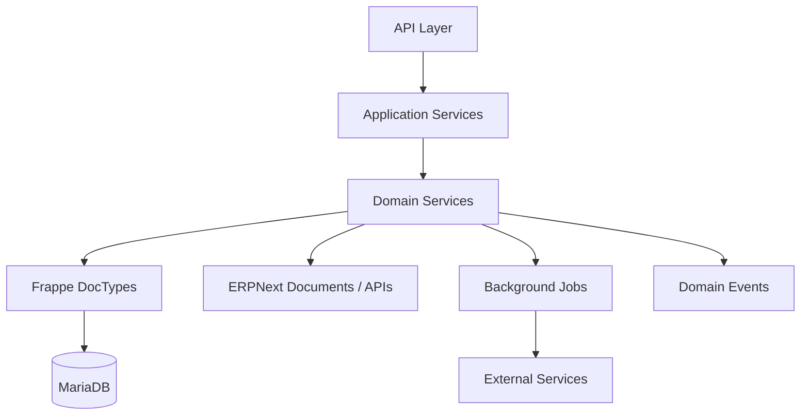
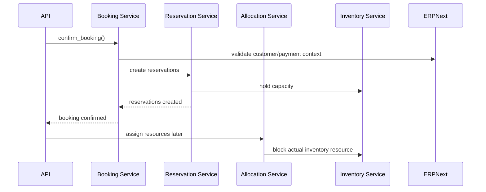

# Backend Architecture

## Document Control

| Field | Value |
|---|---|
| Document | Backend Architecture |
| Version | 1.0 |
| Status | Draft |
| Repository | farhanmae/gotripzee_docs |
| Related Documents | [Solution Architecture](./08-solution-architecture.md), [Database Design](./09-database-design.md), [API Specification](./10-api-specification.md), [Integration Architecture](./13-integration-architecture.md), [Security Architecture](./14-security-architecture.md) |

## 1. Purpose

This document defines the target backend architecture for the GoTripzee custom Frappe travel application. It explains how the backend should be structured as an upgrade-safe, domain-driven modular monolith that extends ERPNext without modifying ERPNext core.

## 2. Scope

The backend architecture covers:

- Frappe custom app structure
- domain modules
- DocType ownership
- service boundaries
- document lifecycle logic
- background jobs
- API layer
- ERPNext extension patterns
- data access and transaction boundaries
- event handling
- observability and auditability

## 3. Backend Design Goals

| Goal | Description |
|---|---|
| Upgrade-safe ERPNext | No ERPNext core modifications. |
| Modular monolith | One deployable Frappe app with clear internal modules. |
| Domain-driven | Modules align to travel business capabilities. |
| API-first | React and future channels use stable backend APIs. |
| Document-centric | Use Frappe DocTypes for persistence, workflow, permissions, and audit. |
| Event-aware | Important business transitions emit domain events. |
| Transaction-safe inventory | Booking, reservation, allocation, and inventory changes must be consistent. |

## 4. High-Level Backend Architecture

## 5. Frappe Application Boundary

All travel-specific logic should live inside a custom Frappe app.

The custom app owns:

- Travel Product
- Product Offering
- Travel Product Company Configuration
- Package Component
- Booking
- Booking Item
- Reservation
- Allocation
- Inventory Resource
- Inventory Calendar
- Itinerary
- Travel Operation
- Travel-specific Pricing Rule
- Supplier Capability
- Travel Document
- Integration Log where travel-specific

ERPNext owns:

- Company
- Customer
- Supplier
- Employee
- User
- Contact
- Address
- CRM core objects
- Sales Invoice
- Purchase Invoice
- Payment Entry
- Accounting

## 6. Suggested Module Structure

| Module | Responsibility |
|---|---|
| catalog | Travel Products, Offerings, Company enablement |
| package | Package composition and reusable component rules |
| pricing | Travel-specific pricing evaluation |
| booking | Booking and Booking Item lifecycle |
| reservation | Capacity commitment and reservation lifecycle |
| allocation | Operational assignment and inventory blocking |
| inventory | Inventory Resource and Inventory Calendar |
| operations | Travel Operation tasks and fulfilment workflow |
| integration | Payment, SMS, email, supplier, ERPNext coordination |
| reporting | Operational and management reporting APIs |
| common | Shared utilities, validation, events, constants |

## 7. Layer Responsibilities

### 7.1 API Layer

Responsibilities:

- request validation
- authentication and authorization checks
- input normalization
- response formatting
- idempotency handling
- correlation ID propagation

### 7.2 Application Service Layer

Responsibilities:

- orchestration of user/application actions
- transaction boundaries
- coordination across domain services
- workflow transitions
- background job enqueueing

### 7.3 Domain Service Layer

Responsibilities:

- business rules
- pricing evaluation
- availability checks
- package expansion
- reservation creation
- allocation and inventory blocking
- lifecycle validation

### 7.4 Document Layer

Responsibilities:

- Frappe DocType persistence
- field validation
- document permissions
- workflow state
- audit history

## 8. Core Domain Services

| Service | Responsibility |
|---|---|
| Travel Product Service | Manage reusable products, offerings, and visibility. |
| Package Composition Service | Expand packages into component reservations without duplicating product data. |
| Pricing Service | Evaluate company, season, offering, occupancy, and package pricing. |
| Booking Service | Create and transition commercial bookings. |
| Reservation Service | Commit capacity against booking items. |
| Allocation Service | Assign actual rooms, vehicles, seats, slots, or activity capacity. |
| Inventory Service | Check and block shared inventory safely. |
| Operations Service | Generate and track fulfilment tasks. |
| ERPNext Integration Service | Link to customers, suppliers, invoices, payment entries, and CRM records. |

## 9. Document Lifecycle Model

## 10. Booking, Reservation, Allocation Separation

The backend must enforce these lifecycle boundaries:

| Concept | Backend Meaning |
|---|---|
| Booking | Commercial commitment. |
| Reservation | Capacity commitment. |
| Allocation | Specific operational assignment. |

Rules:

- Booking confirmation may create reservations.
- Reservations may exist before actual allocation.
- Allocation may be changed without rewriting Booking.
- Inventory must be blocked through Reservation or Allocation services, not directly from UI code.

## 11. Package Expansion Pattern

When a package booking is confirmed:

1. Booking Item references the package Travel Product and selected Product Offering.
2. Package Composition Service expands package components.
3. Reservation Service creates reservations for component products that consume capacity.
4. Inventory Service evaluates shared inventory across direct and package sales.
5. Allocation Service assigns actual resources when operations is ready.

This preserves the rule that packages never duplicate underlying product data.

## 12. ERPNext Extension Pattern

Supported extension mechanisms:

- Custom DocTypes
- hooks
- document events
- fixtures
- custom fields where appropriate
- workflow configuration
- custom APIs
- scheduled jobs
- background workers
- permission extensions

Not allowed:

- modifying ERPNext core files
- duplicating ERPNext master data as independent source of truth
- bypassing ERPNext finance/accounting documents for financial records

## 13. Event Architecture

Key domain events:

- Travel Product Published
- Offering Enabled
- Enquiry Created
- Quotation Generated
- Booking Confirmed
- Payment Received
- Reservation Created
- Reservation Released
- Allocation Created
- Allocation Reassigned
- Inventory Blocked
- Booking Cancelled
- Trip Completed

Events should support:

- notifications
- audit history
- integration triggers
- reporting
- future AI workflows

## 14. Background Jobs

Background jobs should handle:

- email and SMS sending
- payment reconciliation checks
- supplier synchronization
- report generation
- delayed reservation expiry
- allocation reminders
- integration retries
- search index refresh

Critical booking confirmation and inventory blocking should remain transaction-safe and should not depend on delayed jobs for correctness.

## 15. Data Access and Transactions

Transaction boundaries should protect:

- booking confirmation
- reservation creation
- inventory hold/block/release
- allocation creation/reassignment
- cancellation and release flows
- payment status updates

Concurrency risks must be addressed for inventory resources. Overlapping allocation or double booking must be prevented by backend validation and database-level controls where Frappe/MariaDB allow.

## 16. Permissions

Backend permissions should combine:

- Frappe role permissions
- ERPNext role model
- Company context
- document ownership
- workflow state
- operational responsibility

The backend must never rely only on frontend controls.

## 17. Observability

Backend observability should include:

- application logs
- request correlation IDs
- domain event logs
- integration logs
- workflow transition history
- failed job tracking
- inventory conflict logs
- payment reconciliation logs

## 18. Summary

The backend architecture establishes a custom Frappe travel application as the home for all travel-specific business logic. ERPNext remains the enterprise system of record, while the travel app manages Travel Products, Offerings, Packages, Bookings, Reservations, Allocations, Inventory, and Operations through upgrade-safe extension patterns.

## 19. Traceability to Next Documents

This document feeds into:

- [Integration Architecture](./13-integration-architecture.md)
- [Security Architecture](./14-security-architecture.md)
- [Deployment Architecture](./15-deployment-architecture.md)
- [Testing Strategy](./17-testing-strategy.md)
- [Operational Runbook](./18-operational-runbook.md)
