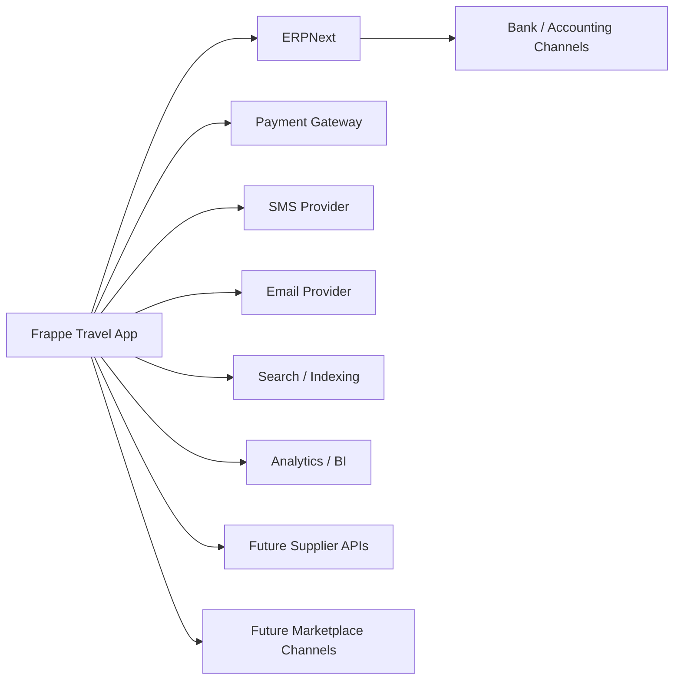
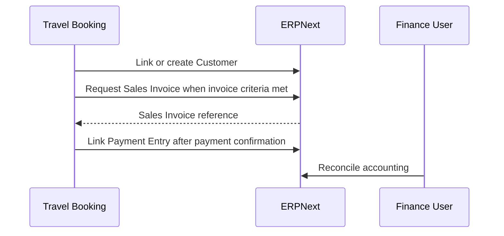
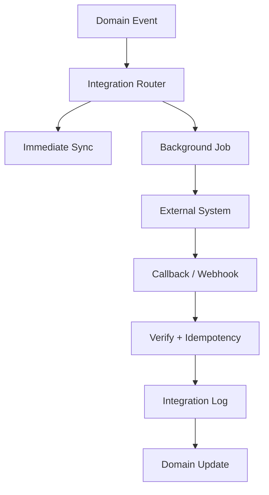

# Integration Architecture

## Document Control

| Field | Value |
|---|---|
| Document | Integration Architecture |
| Version | 1.0 |
| Status | Draft |
| Repository | farhanmae/gotripzee_docs |
| Related Documents | [Solution Architecture](./08-solution-architecture.md), [API Specification](./10-api-specification.md), [Backend Architecture](./12-backend-architecture.md), [Security Architecture](./14-security-architecture.md), [Operational Runbook](./18-operational-runbook.md) |

## 1. Purpose

This document defines how the GoTripzee travel platform integrates with ERPNext and external systems. It establishes ownership boundaries, integration patterns, callback handling, failure management, and future extensibility for supplier and marketplace integrations.

## 2. Scope

In scope:

- ERPNext integration
- payment gateway integration
- SMS and email notification integration
- supplier and partner integration readiness
- customer authentication integration
- reporting and analytics integration
- future marketplace integration
- integration security and observability

## 3. Integration Principles

1. ERPNext is the enterprise system of record.
2. The travel application owns travel-specific workflows.
3. Integrations must be API-first and event-aware.
4. Financial integrations must reconcile with ERPNext accounting documents.
5. Integration callbacks must be idempotent and auditable.
6. Secrets must never be stored in source code.
7. Failed integrations must be visible and retryable.

## 4. Integration Landscape

## 5. ERPNext Integration

### 5.1 Ownership Boundary

| Domain | Owner | Integration Approach |
|---|---|---|
| Company | ERPNext | Reference ERPNext Company. |
| Customer | ERPNext | Create/link Customer through ERPNext APIs or document methods. |
| Supplier | ERPNext | Reference Supplier and extend with Supplier Capability. |
| Employee/User | ERPNext/Frappe | Reuse identity and role model. |
| Sales Invoice | ERPNext | Create/link invoice after booking/payment rules. |
| Payment Entry | ERPNext | Record/reconcile payments through ERPNext. |
| Purchase Invoice | ERPNext | Use for supplier settlement. |
| Travel Product | Travel App | Travel-owned DocType. |
| Booking | Travel App | Travel-owned commercial document linked to ERPNext finance documents. |

### 5.2 Interaction Pattern

## 6. Payment Integration

The payment gateway integration should support online payment collection while preserving ERPNext finance ownership.

Required capabilities:

- payment initiation
- payment callback verification
- payment status update
- idempotent callback handling
- Booking payment status update
- ERPNext Payment Entry linkage
- refund request and reconciliation flow

Payment events:

- Payment Initiated
- Payment Authorized
- Payment Captured
- Payment Failed
- Refund Initiated
- Refund Completed

## 7. Notification Integration

Notification channels include:

- transactional email
- OTP or SMS
- booking confirmation
- payment confirmation
- reservation/allocation updates
- cancellation/refund notifications
- operations reminders

Notification rules should be configuration-driven by Company, product type, workflow state, and customer preference.

## 8. Supplier Integration

Supplier integration should be designed as a future extension, not as a blocking requirement for the first release.

Future supplier capabilities:

- availability query
- rate query
- booking request
- booking confirmation
- cancellation request
- voucher/document exchange
- inventory feed ingestion

Supplier remains ERPNext-owned. Travel-specific capability, supported areas, allocation rules, and integration credentials belong to the travel application extension layer.

## 9. Marketplace Integration

Marketplace readiness should support future channels such as B2B agents, white-label storefronts, corporate travel, and external resellers.

Required future patterns:

- channel-specific product enablement
- company-aware pricing
- API credentials per channel
- booking source tracking
- commission or margin metadata
- rate limiting
- partner-facing audit logs

## 10. Integration Event Model

## 11. Integration Log

Every external integration should write an Integration Log or equivalent audit record.

| Field | Purpose |
|---|---|
| integration_type | Payment, SMS, Email, Supplier, ERPNext, Marketplace |
| related_document | Booking, Reservation, Allocation, Payment, Customer |
| request_payload_reference | Sanitized or secured reference |
| response_payload_reference | Sanitized or secured reference |
| status | Pending, Success, Failed, Retrying, Dead Letter |
| attempt_count | Retry governance |
| correlation_id | Traceability |
| error_code | Machine-readable failure reason |

## 12. Error and Retry Strategy

| Failure Type | Handling |
|---|---|
| Temporary network failure | Retry with backoff. |
| Authentication failure | Stop retry and alert administrator. |
| Validation failure | Mark failed and require business correction. |
| Duplicate callback | Acknowledge idempotently without duplicate mutation. |
| Payment ambiguity | Mark for finance review and reconcile with provider/ERPNext. |
| Supplier no availability | Raise operational exception. |

## 13. Security Controls

Integration security must include:

- secret management outside source code
- request signing where supported
- webhook signature verification
- IP allowlisting where appropriate
- TLS
- idempotency keys
- replay protection
- role-restricted integration logs
- redaction of sensitive payload fields

## 14. Data Synchronization Guidance

Preferred approach:

- reference ERPNext master data rather than duplicating it
- synchronize only travel-specific extension metadata into the travel app
- use events and background jobs for non-critical synchronization
- keep financial posting authoritative in ERPNext

## 15. Summary

The integration architecture keeps ERPNext authoritative for enterprise and finance data while allowing the Frappe travel application to orchestrate travel-specific processes. Integrations must be secure, observable, idempotent, and designed for future supplier and marketplace expansion.

## 16. Traceability to Next Documents

This document feeds into:

- [Security Architecture](./14-security-architecture.md)
- [Deployment Architecture](./15-deployment-architecture.md)
- [Testing Strategy](./17-testing-strategy.md)
- [Operational Runbook](./18-operational-runbook.md)
