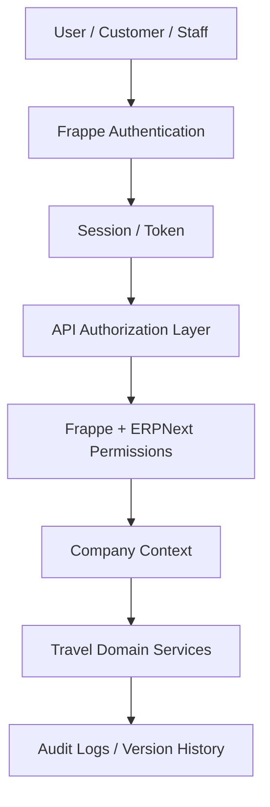

# Security Architecture

## Document Control

| Field | Value |
|---|---|
| Document | Security Architecture |
| Version | 1.0 |
| Status | Draft |
| Repository | farhanmae/gotripzee_docs |
| Related Documents | [Guiding Architecture Principles](./05-guiding-architecture-principles.md), [API Specification](./10-api-specification.md), [Frontend Architecture](./11-frontend-architecture.md), [Backend Architecture](./12-backend-architecture.md), [Integration Architecture](./13-integration-architecture.md) |

## 1. Purpose

This document defines the target security architecture for the modernized GoTripzee platform. It describes identity, authorization, API protection, data security, integration security, auditability, and operational controls for the React, Frappe, ERPNext, and MariaDB platform.

## 2. Security Goals

| Goal | Description |
|---|---|
| Protect customer data | Secure personal, travel, payment, and communication data. |
| Protect financial integrity | ERPNext finance documents must remain accurate and controlled. |
| Enforce company boundaries | Product visibility and operational data must respect Company context. |
| Preserve upgrade safety | Security extensions must not modify ERPNext core. |
| Protect APIs | All APIs must validate identity, authorization, and input. |
| Audit critical actions | Booking, Reservation, Allocation, payment, and integration actions must be traceable. |

## 3. Security Architecture Overview

## 4. Identity and Authentication

Authentication should reuse Frappe and ERPNext-supported identity mechanisms.

Expected identity types:

- customer user
- sales user
- operations user
- finance user
- administrator
- supplier or partner user in future phases
- API integration credential

Authentication controls:

- secure password policies
- optional OTP or MFA where business risk requires
- session timeout
- secure cookies
- CSRF controls for browser sessions
- token rotation for integration users

## 5. Authorization Model

Authorization must combine:

- Frappe role permissions
- ERPNext role model
- Company access
- document ownership
- workflow state
- operational assignment
- API scope

| Role | Typical Access |
|---|---|
| Customer | Own enquiries, quotations, bookings, documents, support records. |
| Sales | Enquiries, quotations, booking creation, customer communication. |
| Operations | Reservations, allocations, fulfilment tasks, operational exceptions. |
| Finance | Payments, invoice links, refunds, reconciliation views. |
| Admin | Product configuration, Company enablement, workflow setup. |
| Supplier / Partner | Future restricted access to assigned inventory or bookings only. |

## 6. Company-Aware Security

Company context is mandatory for:

- product visibility
- offering visibility
- pricing rules
- booking ownership
- staff access
- reporting
- channel access

Rules:

- a user must not see products disabled for their active Company
- staff access must be limited by assigned Company where applicable
- finance documents remain governed by ERPNext permissions
- cross-company reporting requires explicit management permission

## 7. API Security

API controls:

- authentication required for non-public APIs
- public catalog APIs return only published and company-enabled data
- authorization checks on every protected endpoint
- input validation and schema checks
- rate limiting for public and login-related APIs
- idempotency for payment, booking confirmation, reservation, and allocation actions
- consistent error responses without leaking stack traces
- audit logging for state transitions

## 8. Data Security

Sensitive data categories:

| Data | Security Treatment |
|---|---|
| Customer personal data | Access-controlled, audit-visible, encrypted at rest where platform supports. |
| Travel documents | Restricted by booking ownership and staff role. |
| Payment references | Store tokens/references only; never store raw card data. |
| Integration credentials | Secret manager or site configuration, never source code. |
| Supplier rates | Role- and Company-restricted. |
| Operational notes | Staff-only access with auditability. |

## 9. Integration Security

Integration controls:

- webhook signature verification
- signed requests where supported
- integration user separation
- secret rotation
- payload redaction
- retry limits
- replay protection
- integration logs with restricted access
- no direct trust of external callback status without verification

## 10. Payment Security

Payment architecture rules:

- payment gateway handles sensitive payment collection
- platform stores payment references and statuses, not raw payment credentials
- callbacks must be verified and idempotent
- payment state must reconcile with ERPNext Payment Entry or finance process
- refunds require role-based approval and audit

## 11. Audit and Compliance

Auditable actions:

- user login and privilege changes
- product publication and Company enablement changes
- pricing rule changes
- booking creation, confirmation, cancellation
- reservation creation and release
- allocation assignment and reassignment
- inventory block/release
- payment/refund status changes
- integration callback processing

## 12. Threat Considerations

| Threat | Control |
|---|---|
| Unauthorized booking access | Document ownership and role checks. |
| Cross-company data leakage | Company context enforcement. |
| Inventory tampering | Backend-only inventory services and audit trail. |
| Payment spoofing | Gateway signature verification and idempotency. |
| API abuse | Rate limiting, validation, logging. |
| Secret exposure | Externalized secrets and redacted logs. |
| ERPNext upgrade breakage | No core modifications. |

## 13. Security Testing

Security testing should include:

- role permission tests
- Company boundary tests
- API authorization tests
- integration signature tests
- idempotency tests
- payment callback replay tests
- dependency vulnerability scans
- secrets scanning

## 14. Summary

The security architecture protects GoTripzee by combining Frappe and ERPNext permission models with Company-aware access, API controls, secure integration handling, and auditability across Booking, Reservation, Allocation, inventory, and finance-related workflows.

## 15. Traceability to Next Documents

This document feeds into:

- [Deployment Architecture](./15-deployment-architecture.md)
- [Testing Strategy](./17-testing-strategy.md)
- [Operational Runbook](./18-operational-runbook.md)
