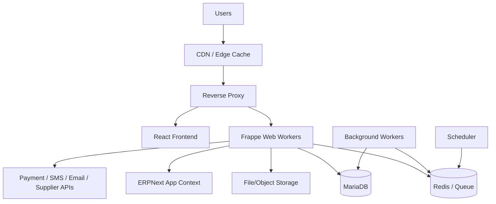
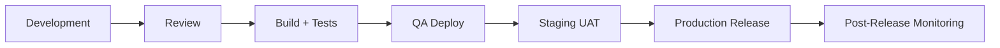

# Deployment Architecture

## Document Control

| Field | Value |
|---|---|
| Document | Deployment Architecture |
| Version | 1.0 |
| Status | Draft |
| Repository | farhanmae/gotripzee_docs |
| Related Documents | [Solution Architecture](./08-solution-architecture.md), [Backend Architecture](./12-backend-architecture.md), [Integration Architecture](./13-integration-architecture.md), [Security Architecture](./14-security-architecture.md), [Operational Runbook](./18-operational-runbook.md) |

## 1. Purpose

This document defines the target deployment architecture for the GoTripzee modernization platform. It describes environments, runtime components, infrastructure dependencies, release flow, backup strategy, observability, and operational expectations.

## 2. Deployment Goals

- support development, staging, and production environments
- keep ERPNext upgrade-safe
- deploy React frontend and Frappe backend independently where practical
- support background jobs and scheduler workers
- protect MariaDB and Redis
- externalize secrets and environment-specific configuration
- support repeatable release and rollback procedures

## 3. Runtime Architecture

## 4. Environment Model

| Environment | Purpose |
|---|---|
| Local Development | Developer implementation and unit testing. |
| Integration / QA | API, workflow, and integration validation. |
| Staging | Production-like release validation and UAT. |
| Production | Live customer and staff operations. |
| Disaster Recovery | Restore target for critical business continuity. |

## 5. Component Deployment

| Component | Deployment Notes |
|---|---|
| React frontend | Static build hosted through web server/CDN or equivalent app hosting. |
| Frappe application | Custom travel app installed alongside ERPNext in supported Frappe bench/site structure. |
| ERPNext | Standard ERPNext installation; no core modifications. |
| MariaDB | Primary relational data store. |
| Redis | Cache, queue, and real-time support. |
| Workers | Required for notifications, integrations, reporting, and retries. |
| Scheduler | Required for reservation expiry, reminders, sync, and maintenance jobs. |
| Reverse proxy | TLS termination, routing, compression, and security headers. |
| File storage | Product media, documents, vouchers, attachments. |

## 6. Configuration Management

Configuration categories:

- environment variables
- Frappe site configuration
- integration secrets
- Company-specific settings
- feature flags
- notification templates
- pricing and workflow configuration

Rules:

- secrets must not be committed to Git
- environment-specific configuration must be externalized
- Company-specific business behavior should be configured in DocTypes, not code
- deployment automation should be repeatable

## 7. Release Flow

## 8. Deployment Units

Recommended deployment units:

- React frontend build
- custom Frappe travel app
- Frappe/ERPNext app dependencies
- database migrations / DocType changes
- fixtures and configuration changes
- background worker process definitions

## 9. Database Migration Deployment

Database and DocType changes require controlled deployment.

Controls:

- migration scripts reviewed before release
- staging migration rehearsal
- production backup before migration
- rollback plan
- post-migration validation
- document schema compatibility checks

## 10. Availability and Scaling

Scaling considerations:

- horizontal scaling of web workers
- separate worker queues for slow integrations and critical jobs
- cache product catalog reads where safe
- avoid long-running work in request lifecycle
- monitor MariaDB query performance
- use read-optimized reporting structures where needed

## 11. Backup and Recovery

Backup scope:

- MariaDB
- Frappe site files
- private files
- configuration
- integration logs where required
- frontend build artifacts

Recovery expectations:

- documented restore process
- periodic restore tests
- defined RPO and RTO
- separate backup storage
- production-like recovery rehearsal

## 12. Observability

Deployment must support:

- application logs
- worker logs
- scheduler logs
- API metrics
- error tracking
- job queue monitoring
- MariaDB metrics
- Redis metrics
- uptime monitoring
- integration failure alerts

## 13. Security Controls

Deployment security:

- TLS everywhere
- secure headers
- least-privilege server access
- SSH key governance
- secret rotation
- restricted database access
- private file protection
- dependency vulnerability checks
- production access audit

## 14. Summary

The deployment architecture supports a production-grade React, Frappe, ERPNext, MariaDB, and Redis platform with controlled environments, secure configuration, reliable releases, background processing, observability, and backup/recovery discipline.

## 15. Traceability to Next Documents

This document feeds into:

- [Migration Strategy](./16-migration-strategy.md)
- [Testing Strategy](./17-testing-strategy.md)
- [Operational Runbook](./18-operational-runbook.md)
- [Roadmap](./19-roadmap.md)
