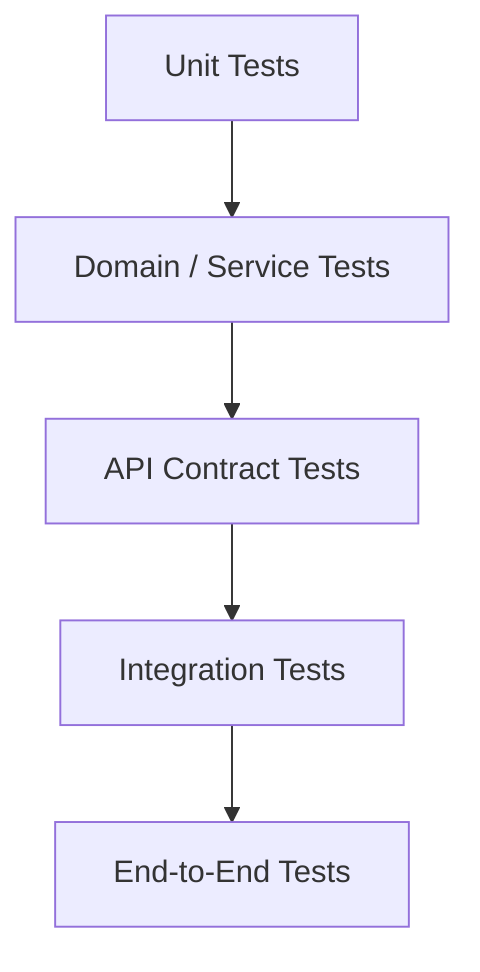

# Testing Strategy

## Document Control

| Field | Value |
|---|---|
| Document | Testing Strategy |
| Version | 1.0 |
| Status | Draft |
| Repository | farhanmae/gotripzee_docs |
| Related Documents | [Business Requirements Document](./07-business-requirements-document.md), [API Specification](./10-api-specification.md), [Frontend Architecture](./11-frontend-architecture.md), [Backend Architecture](./12-backend-architecture.md), [Migration Strategy](./16-migration-strategy.md) |

## 1. Purpose

This document defines the testing strategy for the GoTripzee modernization program. It ensures the target platform satisfies business requirements, preserves critical behaviors, protects inventory correctness, and remains secure and reliable.

## 2. Testing Goals

- validate the domain model
- verify APIs and workflows
- protect Booking, Reservation, and Allocation separation
- validate shared inventory across direct and package sales
- verify ERPNext ownership boundaries
- validate migration accuracy
- confirm security and Company-aware access
- support safe releases

## 3. Test Pyramid

## 4. Test Types

| Test Type | Purpose |
|---|---|
| Unit tests | Validate isolated functions and rules. |
| Domain service tests | Validate booking, pricing, reservation, allocation, and inventory rules. |
| API tests | Validate request/response contracts, permissions, and errors. |
| Integration tests | Validate ERPNext, payment, SMS/email, and supplier integrations. |
| Frontend tests | Validate UI flows and component behavior. |
| End-to-end tests | Validate full customer and staff journeys. |
| Migration tests | Validate source-to-target data migration. |
| Security tests | Validate access, authorization, and integration controls. |
| Performance tests | Validate critical catalog, booking, and inventory paths. |

## 5. Critical Business Rule Tests

| Rule | Required Test |
|---|---|
| Travel Product is reusable | Same product can appear in direct sale and package composition. |
| Product has multiple offerings | Budget/Standard/Premium/Luxury or configured offerings can be priced independently. |
| Package references products | Package components reference existing Travel Products, not duplicated data. |
| Booking is commercial commitment | Booking confirmation does not imply final resource assignment. |
| Reservation is capacity commitment | Reservation can be created and released independently from allocation. |
| Allocation is operational assignment | Allocation assigns actual room, vehicle, seat, or activity slot. |
| Shared inventory | Direct stay sale and package-included stay consume same inventory. |
| Company-aware enablement | Disabled products do not appear or sell for that Company. |
| ERPNext upgrade safety | No tests require ERPNext core modifications. |

## 6. API Testing

API tests should cover:

- authentication
- authorization
- Company boundary enforcement
- validation errors
- pagination
- idempotency
- state transitions
- payment callback verification
- reservation and allocation transitions
- error envelopes

## 7. Frontend Testing

Frontend tests should cover:

- product discovery
- offering selection
- package component display
- enquiry form
- booking flow
- customer dashboard
- staff operations screens
- accessibility
- responsive behavior
- API error handling

## 8. Backend Testing

Backend tests should cover:

- DocType validation
- document events
- domain services
- background jobs
- permissions
- workflow transitions
- integration log behavior
- inventory concurrency rules

## 9. Migration Testing

Migration testing should verify:

- row counts by source and target entity
- customer matching
- product classification
- offering mapping
- package component mapping
- booking status mapping
- payment reference preservation
- media migration
- exception reporting

## 10. Security Testing

Security testing should include:

- role permission tests
- Company access tests
- customer ownership tests
- API authorization tests
- webhook signature tests
- idempotency and replay tests
- secrets scanning
- dependency vulnerability scans

## 11. Performance Testing

Performance test targets:

- catalog listing
- product detail
- pricing preview
- availability check
- booking confirmation
- reservation creation
- allocation dashboard
- migration batch throughput

## 12. UAT Scenarios

Representative UAT scenarios:

1. customer submits enquiry for package
2. sales creates quotation
3. customer approves quotation
4. booking is confirmed
5. reservation is created
6. operations allocates stay and transfer
7. package stay blocks shared inventory
8. payment is reconciled with ERPNext
9. booking is cancelled and inventory released
10. Company-disabled product is hidden

## 13. Release Quality Gates

Release should not proceed unless:

- critical tests pass
- migration reconciliation is accepted
- security tests pass
- payment callback tests pass
- inventory conflict tests pass
- rollback plan exists
- operational team signs off UAT

## 14. Summary

The testing strategy focuses on protecting the business-critical modernization rules: reusable Travel Products, composable Packages, shared Inventory, Company-aware enablement, ERPNext ownership, and the separation of Booking, Reservation, and Allocation.

## 15. Traceability to Next Documents

This document feeds into:

- [Operational Runbook](./18-operational-runbook.md)
- [Roadmap](./19-roadmap.md)
- [Appendix](./20-appendix.md)
