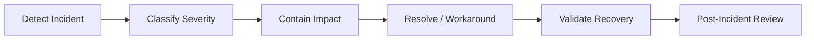

# Operational Runbook

## Document Control

| Field | Value |
|---|---|
| Document | Operational Runbook |
| Version | 1.0 |
| Status | Draft |
| Repository | farhanmae/gotripzee_docs |
| Related Documents | [Deployment Architecture](./15-deployment-architecture.md), [Migration Strategy](./16-migration-strategy.md), [Testing Strategy](./17-testing-strategy.md), [Security Architecture](./14-security-architecture.md) |

## 1. Purpose

This document defines operational runbook guidance for running the modernized GoTripzee platform. It covers monitoring, incidents, backups, releases, integration failures, booking exceptions, inventory issues, and support procedures.

## 2. Operating Goals

- keep customer booking flows available
- protect inventory correctness
- ensure payments reconcile with ERPNext
- keep integrations observable and recoverable
- support operational staff during exceptions
- preserve auditability
- enable repeatable release and recovery processes

## 3. Operational Ownership

| Area | Primary Owner |
|---|---|
| Platform uptime | Technical operations |
| React frontend | Frontend / platform team |
| Frappe travel app | Backend / platform team |
| ERPNext finance | Finance / ERP administrator |
| Product configuration | Product manager / admin |
| Booking exceptions | Sales and operations |
| Reservation/allocation issues | Operations |
| Payment reconciliation | Finance |
| Security incidents | Security / technical leadership |

## 4. Monitoring Checklist

| Monitor | Why It Matters |
|---|---|
| API availability | Customer and staff flows depend on APIs. |
| Booking confirmation failures | Direct revenue impact. |
| Payment callback failures | Finance and customer experience impact. |
| Inventory conflict errors | Overbooking risk. |
| Worker queue backlog | Notifications and integrations may be delayed. |
| Scheduler health | Expiry, reminders, and recurring jobs depend on it. |
| MariaDB health | Core persistence. |
| Redis health | Queue/cache/session support. |
| Integration failures | Payment, SMS, email, supplier workflows. |

## 5. Standard Operating Procedures

### 5.1 Release Procedure

1. confirm release scope
2. verify tests and UAT
3. confirm backup
4. deploy to staging
5. run smoke tests
6. deploy to production
7. run production smoke tests
8. monitor error rates and booking/payment flows
9. communicate release completion

### 5.2 Rollback Procedure

Rollback plan must define:

- frontend artifact rollback
- Frappe app rollback
- database migration rollback or forward-fix decision
- queue pause/resume
- integration callback handling during rollback
- customer/staff communication if needed

### 5.3 Backup Procedure

Backup must include:

- MariaDB
- Frappe site files
- private files
- configuration
- critical logs where required

Backups should be tested through periodic restore rehearsals.

## 6. Incident Response

Severity examples:

| Severity | Example |
|---|---|
| Critical | Booking confirmation down, payment callbacks failing, database unavailable. |
| High | Inventory allocation conflicts, login outage, staff operations blocked. |
| Medium | SMS/email delays, reporting unavailable, non-critical integration failure. |
| Low | UI defect with workaround, minor content/admin issue. |

## 7. Booking Exception Runbook

When booking confirmation fails:

1. capture Booking ID and correlation ID
2. check API logs
3. check payment status if payment involved
4. check reservation generation status
5. check inventory conflict messages
6. avoid manual database edits
7. resolve through controlled backend/admin workflow
8. notify customer or sales team if customer-facing

## 8. Inventory Conflict Runbook

When inventory conflict occurs:

1. identify Travel Product and Inventory Resource
2. identify direct sale and package sale paths involved
3. inspect Reservation and Allocation records
4. confirm overlapping date/time window
5. release or reassign only through Allocation or Reservation workflow
6. record operational notes
7. review whether pricing/catalog availability cache requires refresh

## 9. Payment Failure Runbook

When payment callback or reconciliation fails:

1. check payment gateway dashboard
2. verify callback signature/log
3. check idempotency key and duplicate callback status
4. check Booking payment status
5. check ERPNext Payment Entry or invoice linkage
6. reconcile with finance
7. update customer communication through approved workflow

## 10. Integration Failure Runbook

For SMS, email, payment, supplier, or marketplace integrations:

- check Integration Log
- inspect sanitized request/response references
- identify retry status
- determine whether failure is temporary, credential-related, or data-related
- retry if safe
- escalate credential/security failures
- preserve audit trail

## 11. Security Incident Runbook

Security incident steps:

1. contain access
2. preserve logs
3. rotate affected secrets
4. identify affected users/documents
5. review API and authentication logs
6. notify stakeholders according to policy
7. document remediation

## 12. Operational Dashboards

Recommended dashboards:

- booking funnel
- payment status
- reservation backlog
- allocation pending
- inventory conflicts
- integration failures
- worker queue backlog
- product enablement by Company
- daily bookings and cancellations

## 13. Summary

The operational runbook establishes procedures for safely running the modernized platform. It emphasizes booking continuity, payment reconciliation, inventory correctness, integration observability, and controlled operational recovery.

## 14. Traceability to Next Documents

This document feeds into:

- [Roadmap](./19-roadmap.md)
- [Appendix](./20-appendix.md)
