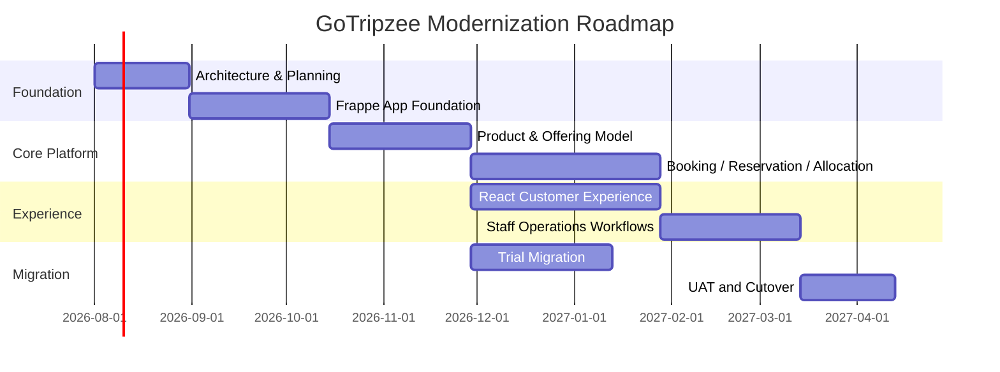

# Roadmap

## Document Control

| Field | Value |
|---|---|
| Document | Roadmap |
| Version | 1.0 |
| Status | Draft |
| Repository | farhanmae/gotripzee_docs |
| Related Documents | [Executive Summary](./01-executive-summary.md), [Target Operating Model](./04-target-operating-model.md), [Solution Architecture](./08-solution-architecture.md), [Migration Strategy](./16-migration-strategy.md), [Testing Strategy](./17-testing-strategy.md), [Operational Runbook](./18-operational-runbook.md) |

## 1. Purpose

This document defines a phased modernization roadmap for GoTripzee. It organizes the target architecture into practical delivery increments while preserving the core enterprise architecture principles and business rules.

## 2. Roadmap Principles

1. Build the core domain model before advanced channels.
2. Protect ERPNext upgrade safety from the first release.
3. Deliver reusable Travel Product and Product Offering capability early.
4. Implement Booking, Reservation, and Allocation as separate lifecycle stages.
5. Migrate incrementally with strong reconciliation.
6. Avoid duplicating inventory across direct and package sales.
7. Defer marketplace and AI features until the core model is stable.

## 3. Phased Roadmap Overview

Dates are illustrative planning placeholders and should be refined during delivery planning.

## 4. Phase 0 - Architecture and Mobilization

Objectives:

- finalize architecture documents
- confirm governance and decision process
- confirm ERPNext/Frappe deployment assumptions
- identify migration source systems
- define quality gates

Deliverables:

- approved architecture baseline
- implementation backlog
- migration discovery report
- risk register
- environment plan

## 5. Phase 1 - Platform Foundation

Objectives:

- establish Frappe custom travel app
- configure ERPNext integration boundaries
- define base DocTypes
- set up CI/testing/release process
- establish React app shell

Deliverables:

- custom Frappe app skeleton
- base DocTypes and permissions
- React app foundation
- API foundation
- deployment pipeline

## 6. Phase 2 - Product and Package Foundation

Objectives:

- implement Travel Product
- implement Product Offering
- implement Company enablement
- implement Package Composition
- implement catalog APIs

Business value:

- product data becomes reusable
- packages stop duplicating component services
- multi-company readiness begins

## 7. Phase 3 - Booking, Reservation, and Inventory

Objectives:

- implement Booking and Booking Item
- implement Reservation
- implement Inventory Resource and Calendar
- implement shared inventory checks
- implement initial pricing service

Critical acceptance:

- direct Stay sale and package-included Stay consume the same inventory
- Booking is distinct from Reservation
- Reservation is distinct from Allocation

## 8. Phase 4 - Allocation and Operations

Objectives:

- implement Allocation
- implement Travel Operation tasks
- implement operations dashboard
- support reassignment and release
- implement operational exception handling

Business value:

- operations gain visibility and control
- actual room/vehicle/seat/slot assignment is traceable
- commercial booking history remains stable

## 9. Phase 5 - Customer Experience and Payments

Objectives:

- complete React product discovery
- complete enquiry and quotation flows
- complete booking flow
- integrate payment gateway
- integrate ERPNext finance references
- build customer dashboard

## 10. Phase 6 - Migration and Cutover

Objectives:

- run trial migration
- reconcile products, customers, bookings, payments, and media
- complete UAT
- execute cutover
- stabilize production

## 11. Phase 7 - Optimization and Expansion

Potential enhancements:

- supplier portal
- B2B agent portal
- marketplace channels
- dynamic pricing improvements
- advanced analytics
- AI-assisted itinerary generation
- AI-assisted customer support
- mobile application

## 12. Dependency Map

| Capability | Depends On |
|---|---|
| Package booking | Travel Product, Product Offering, Package Composition |
| Shared inventory | Inventory Resource, Reservation, Allocation |
| Payment reconciliation | Booking, ERPNext finance integration |
| Customer dashboard | Booking, Reservation status, documents |
| Supplier integration | Supplier Capability, Allocation, Integration Log |
| Marketplace | Company enablement, API security, channel configuration |

## 13. Risk-Based Priorities

Highest-priority risk reducers:

- inventory model validation
- package component reference model
- ERPNext ownership governance
- payment reconciliation
- migration mapping
- security and Company access model

## 14. Summary

The roadmap sequences GoTripzee modernization from architecture and platform foundations through reusable product modelling, booking/reservation/allocation workflows, React customer experience, migration, and future expansion. The roadmap intentionally stabilizes the core travel business model before marketplace or AI expansion.

## 15. Traceability to Next Documents

This document feeds into:

- [Appendix](./20-appendix.md)
