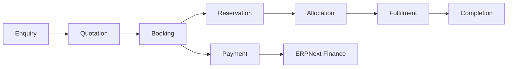
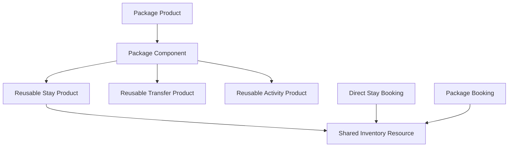

# Appendix

## Document Control

| Field | Value |
|---|---|
| Document | Appendix |
| Version | 1.0 |
| Status | Draft |
| Repository | farhanmae/gotripzee_docs |
| Related Documents | [Executive Summary](./01-executive-summary.md), [Domain Model](./06-domain-model.md), [Solution Architecture](./08-solution-architecture.md), [Roadmap](./19-roadmap.md) |

## 1. Purpose

This appendix provides supporting reference material for the GoTripzee enterprise architecture documentation set. It consolidates terminology, ownership boundaries, critical business rules, document index, and traceability references.

## 2. Document Index

| No. | Document |
|---|---|
| 01 | [Executive Summary](./01-executive-summary.md) |
| 02 | [Current System Assessment](./02-current-system-assessment.md) |
| 03 | [Business Process Analysis (AS-IS)](./03-business-process-analysis-as-is.md) |
| 04 | [Target Operating Model](./04-target-operating-model.md) |
| 05 | [Guiding Architecture Principles](./05-guiding-architecture-principles.md) |
| 06 | [Domain Model](./06-domain-model.md) |
| 07 | [Business Requirements Document](./07-business-requirements-document.md) |
| 08 | [Solution Architecture](./08-solution-architecture.md) |
| 09 | [Database Design](./09-database-design.md) |
| 10 | [API Specification](./10-api-specification.md) |
| 11 | [Frontend Architecture](./11-frontend-architecture.md) |
| 12 | [Backend Architecture](./12-backend-architecture.md) |
| 13 | [Integration Architecture](./13-integration-architecture.md) |
| 14 | [Security Architecture](./14-security-architecture.md) |
| 15 | [Deployment Architecture](./15-deployment-architecture.md) |
| 16 | [Migration Strategy](./16-migration-strategy.md) |
| 17 | [Testing Strategy](./17-testing-strategy.md) |
| 18 | [Operational Runbook](./18-operational-runbook.md) |
| 19 | [Roadmap](./19-roadmap.md) |
| 20 | [Appendix](./20-appendix.md) |

## 3. Ubiquitous Language

| Term | Definition |
|---|---|
| Travel Product | Primary reusable travel business object such as Stay, Package, Weekend Trip, Cab, Activity, Transfer, or Event. |
| Product Offering | Sellable variant of a Travel Product, such as Budget, Standard, Premium, or Luxury. |
| Package | Composition of reusable Travel Products. |
| Booking | Commercial commitment between customer and business. |
| Reservation | Capacity commitment created for a booking or booking item. |
| Allocation | Actual operational assignment of a specific resource. |
| Inventory | Shared capacity consumed by direct and package sales. |
| Company Enablement | Configuration that determines whether a product/offering is available for a Company. |
| ERPNext System of Record | ERPNext ownership of enterprise master and finance data. |

## 4. Ownership Matrix

| Entity / Capability | Owner |
|---|---|
| Company | ERPNext |
| Customer | ERPNext |
| Supplier | ERPNext |
| Employee | ERPNext |
| User | ERPNext / Frappe |
| Contact | ERPNext |
| Address | ERPNext |
| Sales Invoice | ERPNext |
| Purchase Invoice | ERPNext |
| Payment Entry | ERPNext |
| CRM Core | ERPNext |
| Travel Product | Travel App |
| Product Offering | Travel App |
| Package Composition | Travel App |
| Booking | Travel App |
| Reservation | Travel App |
| Allocation | Travel App |
| Inventory Resource | Travel App |
| Pricing Logic | Travel App, with ERPNext price references where applicable |
| Travel Operations | Travel App |

## 5. Critical Business Rules

1. Travel Product is the primary reusable business object.
2. Travel Products can have multiple Product Offerings.
3. Packages are compositions of reusable Travel Products and must not duplicate product data.
4. Booking represents commercial commitment.
5. Reservation represents capacity commitment.
6. Allocation represents actual operational assignment.
7. Booking, Reservation, and Allocation are separate lifecycle stages.
8. Inventory is shared across every selling path.
9. Direct sale and package sale of the same underlying resource consume the same inventory.
10. Products can be enabled or disabled per Company.
11. ERPNext remains the enterprise system of record.
12. ERPNext core must not be modified.

## 6. Architecture Style Summary

| Style | Application |
|---|---|
| Domain Driven Design | Shared language and bounded contexts. |
| Modular Monolith | Custom Frappe travel app with internal modules. |
| API First | React and future channels consume Frappe APIs. |
| Layered Architecture | Presentation, API, application service, domain service, persistence. |
| Event-Aware Architecture | Domain events support notifications, audit, reporting, and future AI. |
| ERPNext Extension | Custom app, DocTypes, hooks, events, APIs, background jobs. |

## 7. Key Lifecycle Diagram

## 8. Package and Inventory Diagram

## 9. Open Architecture Questions

The following items should be resolved during implementation planning:

- final public content management approach for SEO pages
- final payment gateway provider and reconciliation workflow
- final approach for supplier portal timing
- exact ERPNext CRM object usage for enquiry and quotation conversion
- final hosting topology and backup RPO/RTO
- final migration cutover window
- final frontend design system and brand token governance

## 10. Summary

This appendix consolidates the core architecture language, ownership boundaries, business rules, and document index. It should be used as the quick reference for future implementation, migration, and governance discussions.
